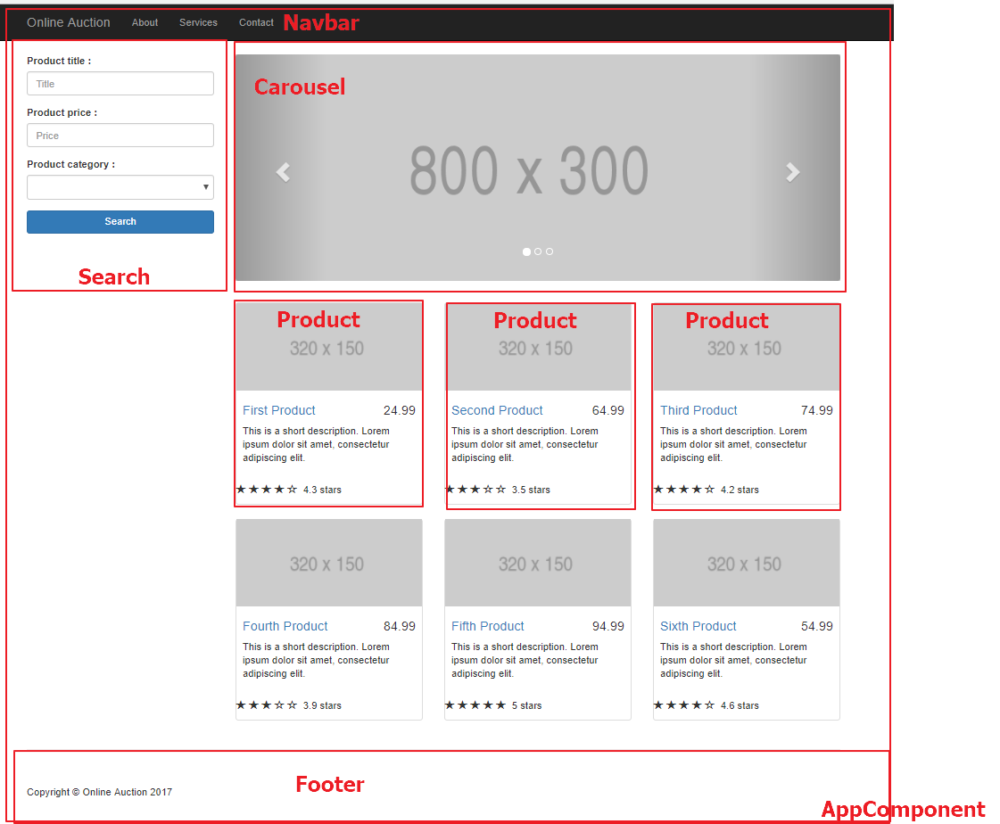
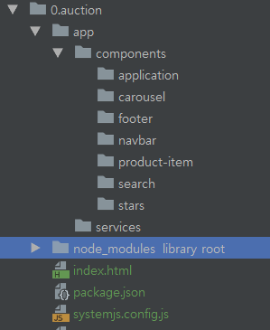
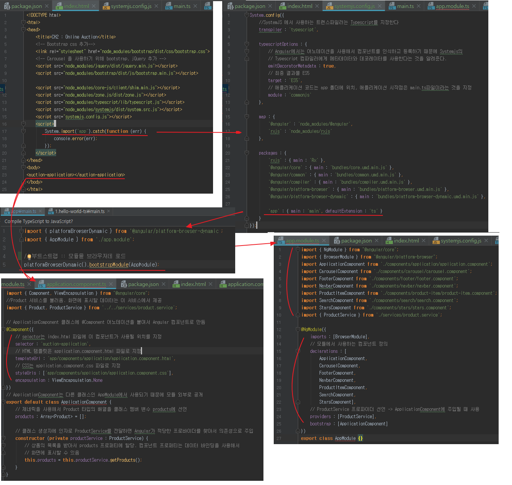

## Index

- <a href="#2.2">Angular 애플리케이션의 구성 요소</a>
- <a href="#2.3">2.3 SystemJS 모듈 로더</a>
- <a href="#2.4">2.4 패키지 매니저 선택하기</a>
- <a href="#2.5">2.5 실습 : 온라인 경매 애플리케이션</a>
- <a href="#summary">Summary</a>

---

> http-server 설치 & 실행(루트 폴더에서)

```
npm i -g http-server
http-server
```

=> http://localhost:8080 접속

> live-server 사용

```
npm i -g live-server
live-server
```


<div id="2.2"></div>

## 2.2 Angular 애플리케이션의 구성 요소

### 2.2.1 모듈(Module)
; 관련된 컴포넌트나 서비스, 디렉티브 등을 편하게 사용하기 위해 하나로 모은 것  

```
// 모듈 정의
@NgModule({
    // 브라우저를 사용하는 모든 앱은 BrowserModule을 불러와야 함
    imports : [ BrowserModule ],
    // AppModule(루트모듈)에 HelloWorldComponent를 선언
    // -> 애플리케이션 전역에서 사용 가능
    declarations : [ HelloWorldComponent ],
    // 애플리케이션을 실행하면 @NgModule 어노테이션의 bootstrap으로 지정 된
    // HelloWorldComponent가 루트 컴포넌트로 렌더링
    bootstrap : [ HelloWorldComponent ]
})
export class AppModule { }

// 루트 애플리케이션 실행
platformBrowserDynamic().bootstrapModule(AppModule);
```

<a href="https://angular.io/guide/ngmodule">Angular Guide docs</a>

### 2.2.2 컴포넌트 (Component)
; Angular 애플리케이션을 구성하는 기본 요소  
=> 화면을 정의하는 뷰와 컴포넌트의 동작을 정의하는 클래스로 구성

```
@Component({
    // 컴포넌트가 위치 할 selector
    selector : 'app-component',
    // 렌더링 될 내용(template or templateUrl)
    template : '<h1> Hello !</h1>'
})
class HelloWorldComponent {}  
```

> 컴포넌트 > JavaScript 코드로 변경

```
@Component({
    selector : 'hello-world',
    template : '<h1>Hello {{name}}!</h1>'
})
class HelloWorldComponent {
    name : string;
    constructor() {
        this.name = 'Angular';
    }
}
...

--- JavaScript Code ---

var HelloWorldComponent = (function() {
  function HelloWorldComponent() {
    this.name = 'Angular';
  }

  return HelloWorldComponent;
}());

HelloWorldComponent = __decorate([
  Component({
    selector : 'hello-world',
    te mplate : '<h1>Hello {{ name }}! </h1>'
    })  
], HelloWorldComponent);

```

=> 템플릿은 HTML 마크업을 기본으로 사용하지만, 서드 파티 프레임워크를 사용하거나  
네이티브 화면을 구성하는 마크업 언어를 사용할 수도 있음

### 2.2.2 디렉티브(Directive)
; HTML 엘리먼트에 사용자가 원하는 동작을 추가할 수 있음  
(@Directive 어노테이션을 클래스에 붙여서 선언)

```
@Directive({
  // 이 셀렉터가 선택하는 HTML 엘리먼트는 log-directive 어트리뷰트가 있는 input 엘리먼트   
  selector : 'input[log-directive]',
  host : {
    // 호스트 엘리먼트에 입력 이벤트를 연결
    // (이 디렉티브에서 호스트 엘리먼트 <input> 엘리먼트)
    '(input)' : 'onInput($event)'
  }
})
class LogDirective {
  onInput(event) { // <input> 엘리먼트의 값을 콘솔로 출력하는 핸들러
    console.log(event.target.value);
  }
}  
```

> e.g) 적용 된 엘리먼트의 배경색을 파란색으로 변경하는 디렉티브

```
import {Directive, ElementRef, Renderer} from '@angular/core';

@Directive({ selector : '[highlight]'})

export class HighlightDirective {
  constructor (renderer : Renderer, el : ElementRef) {
    renderer.setElementStyle(el.nativeElement, 'backgroundColor', 'blue');
  }
}
```

=> 모듈에서 사용되는 모든 디렉티브는 해당 모듈 @NgModule 어노테이션의   
declarations 프로퍼티에 추가되어야 함

```
@NgModule({
  imports : [BrowserModule],
  declarations : [HelloWorldComponent, HighlightDirective],
  bootstrap : [HelloWorldComponent]
})
```

### 2.2.4 데이터 바인딩 기초
;Angular는 컴포넌트의 프로퍼티와 뷰를 동기화시키는 데이터 바인딩을 지원

> 컴포넌트의 프로퍼티 값을 템플릿에 표시

```<h1> Hello {{ name }}! </h1>```

> HTML 엘리먼트의 값을 컴포넌트 프로퍼티로 바인딩

```<span [hidden]="isValid">The field is required</span>```

> 엘리먼트에서 발생한 이벤트를 이벤트 핸들러에 연결  

```<button (click)="paceBid()">Place Bid</button>```

> 다른 엘리먼트의 프로퍼티를 참조

```
<input #title type="text" />
<span>{{ title.value }}</span>
```

---


<div id="2.3"></div>

## 2.3 SystemJS 모듈 로더
;보통 HTML 페이지에서 ```<script>``` 태그를 이용해 JS 파일을 로드 하지만,  
Angular에서는 SystemJS 라이브러리를 사용하는 것을 권장  
<a href="https://github.com/systemjs/systemjs">SystemJS 페이지</a>


### 2.3.1 모듈 로더

- <a href="http://www.ecma-international.org/ecma-262/6.0/#sec-modules">ES6 최종 표준안</a>
- <a href="https://github.com/ModuleLoader/es-module-loader">폴리필</a>

### 2.3.2 모듈 로더 vs ```<script>```로더

> script 태그의 문제점  

- 개발자가 HTML 파일의 script 태그를 관리해야 함  
=> 시간이 지나 필요없는 파일이 존재  
=> 그 파일을 불러오는 script 태그를 삭제하지 않으면, 브라우저에서는  
여전히 파일을 불러옴  
=> 불필요한 네트워크 부하를 유발 & 초기 로드 시간 길어짐
- script 태그의 순서가 문제 될 수 있음.  
=> 브라우저가 보장하는 것은 HTML 문서의 head 안에 있는 script 태그를 순서대로  
실행하는 것 뿐, 그 외의 script 태그는 실행 순서를 보장하지 않음  

> 모듈 로더를 사용하면 좋은 점  
- 개발 단계에서는 애플리케이션 코드를 모듈 단위의 개별 파일로 나눈 것이 일반적  
=> 애플리케이션을 실행할 때 필요한 모듈을 브라우저에 자동으로 불러오기 때문에  
프로젝트를 관리하는데 도움

- 모듈 로더를 사용해 애플리케이션이 시작하는 파일을 기준으로, 사용하는 모든 모듈을  
찾아서 파일 하나로 번들링 할 수 있음  
=> 스크립트를 불러오는 순서나 순환 참조로 인한 오류를 걱정 할 필요X

### 2.3.3 SystemJS 시작하기
; SystemJS를 사용하면 전역 System 객체에서 제공하는 몇 가지 함수를 사용할 수 있음  

> System.import() 함수

```
System.import('./my-module.js'); // 파일 경로로 지정
System.import('@angular2/core'); // 모듈 이름으로 지정

=> 전달 인자가 ./로 시작하면 확장자가 생략되어 있어도 파일 경로로 인식
=> 모듈 이름이 전달되면, System.config()나 systemjs.config.js에 미리 설정 된  
정보를 바탕으로 모듈을 찾아보고 찾지 못하면 경로로 인식하고 파일을 찾음
=> System.import('app') -> SystemJS 설정 먼저 보기
```

=> System.import() 함수가 실행 되면 Promise 객체를 반환  
-> 모듈을 찾아 불러오는 작업이 성공하면 Promise가 fulfilled 상태 반환 & then() 콜백 실행  
-> 실패하면 Promise가 rejected 상태 반환 & catch() 콜백 실행


```
// lib.js
export let foo = 'foo';

// main.js
System.import('./lib.js').then(libModule => {
  libModule.foo === 'foo'; // true
});

=> lib.js 파일을 불러오는데 성공하면, then() 함수 실행
=> 임자로 전달 된 콜백 함수를 이어서 실행
```

> 예제 애플리케이션(4.systemjs-demo)


**SystemJS 설정**  
; System.config() 함수를 사용해 SystemJS의 동작 방식 변경 가능  
=> 같은 옵션을 한 번 이상 설정하면, 나중에 설정된 값만 유효  
<a href="https://github.com/systemjs/systemjs/blob/master/docs/config-api.md">systemjs docs</a>

**baseURL**  
; System.import() 함수에 파일의 이름만 전달되면, 이 옵션으로 설정 된 위치에서 모듈을 찾음  
(import() 함수에 모듈 이름 지정 or 상대 주소 or 절대 주소를 지정하면 위의 설정 무시)

```
System.config({baseURL : '/app'});
System.import('es6module.js'); // GET /app/es6module.js
System.import('./es6module.js'); // GET /es6module.js
System.import('http://example.com/es6module.js'); // GET http://example.com/es6module.js
```

**defaultJSExtension**  
; true : System.import() 함수로 전달하는 인자에 .js 확장자가 자동으로 붙음  
=> 하위 호환성을 위해 제공, SystemJS 0.20.0 버전에서는 삭제 됨

```
System.config({ defaultJSExtension : true });
System.import('./es6module'); // GET /es6module.js
System.import('./es6module.js'); // GET /es6module.js
// 인자에 다른 확장자가 있으면 .js가 한번 더 붙음
System.import('./es6module.ts'); // GET /es6module.ts.js

```

**map**  
; 미리 지정 한 이름으로 모듈을 참조할 수 있는 맵을 만듬  
(함수에 상대,절대 주소를 전달하는 경우 사용X)

```
System.config({ map : {'es6module.js' : 'esSixModule.js'} });
System.import('es6module.js'); // GET /exSixModule.js
System.import('./es6module.js'); // GET /es6module.js
```

> map + baseURL

```
System.config({
  baseURL : '/app',
  map : { 'es6module' : 'exSixModule.js' }
});
System.import('es6module'); // GET /app/esSixModule.js
```

**package**  

> System.import('app') -> main_router_sample.ts 파일을 불러오는 예제

```
System.config({
  packages : {
    app : {
      defaultExtension : 'ts',
      main : 'main_router_sample'
    }
  }
});
```

**paths**  
; map과 비슷 + 특수문자 매칭을 지원  
baseUrl 옵션 적용 => paths 옵션 적용 => map 옵션 적용  

```
System.config({
  baseURL : '/app',
  map : { 'es6module' : 'esSixModule.js'},
  paths : { '*' : 'lib/*'}
});
SYstem.import('es6Module'); // GET /app/lib/esSixModule.js
```

```
import { Component } from '@angular/core';
== @anguler : Angular 프레임워크가 있는 폴더  
== core : 그 패키지의 하위 폴더
== 시작점이 되는 파일 : System.js

e.g)
packages : {
  '@angular/core' : { main : 'index.js' }
}
```

**transpiler**  
; 애플리케이션 모듈을 불러올 때, 코드 변환기를 지정할 수 있음

```
System.config({
  transpiler : 'traceur',
  map : {
    'traceur' : 'https://unpkg.com/traceur@0.0.111/bin/traceur.js'
  }
});
```

**typescriptOptions**  
; TypeScript 컴파일러의 옵션을 SYstemJS에서 지정할 떄 사용

<a href="http://www.typescriptlang.org/docs/handbook/compiler-options.html">TypeScript 컴파일러 옵션 </a>


---

<div id="2.4"></div>

## 2.4 패키지 매니저 선택하기
;라이브러리, 프레임워크, 이들에서 요구하는 또 다른 라이브러리를 관리   
(책에서는 대부분 Angular 프레임워크 사용 & Bootstrap Twiter 라이브러리 이용)

> 온라인 경매 APP에서 사용하는 npm 패키지 매니저의 설정 파일 : package.json  

```
// 커맨드 라인에서 npm 명령을 실행했을 떄 수행되는 작업
"script" : {
  // npm start 명령을 실행하면 live-server 시작
  "start" : "live-server"
},
"dependencies" : { //서드 파티 라이브러리나 툴 목록 정의
  "@angular/common" : "^4.1.0",
  ...
},
"devDependencies" : { // 개발환경에서 사용 & 운영 환경 X
  // ^ : 지정 된 버전 이상 // 그냥은 지정 된 버전
  "live-server" : "1.2.0",
  "typescript" : "^2.3.3"
}
```

<a href="https://docs.npmjs.com/files/package.json#dependencies"> dependencies npm guide</a>

#### 2.4.1 npm vs jspm vs yarn 비교

**npm**  
;npm은 Node.js를 설치하면 같이 설치되는 패키지 매니저

```
var x = require('module1');
// module1 로딩 후 module2 로딩 시작
var y = require('module2');
var z = require('module3');
```

**jspm**  
;ES6의 모듈과 모듈 로더를 위해 만들어진 패키지 매니저  
(스스로 패키지 설치X 패키지의 소스가 어디에 있는지 등록해두고, 가져다 사용)  

**yarn**  
https://yarnpkg.com/lang/en/  
; 기존 package.json, node_modules 폴더를 그대로 이용 & 속도 크게 개선  


#### 2.4.3 yarn으로 Angular 시작하기

> 기본 설정(-y)로 프로젝트 생성

```
...> yarn init -y
yarn init v1.3.2
warning The yes flag has been set. This will automatically answer yes to all questions which may have security implications.
success Saved package.json
Done in 0.04s.
```

>package.json

```
{
  "name": "5.angular-seed",
  "description" : "An initial yarn-managed project for Chapter 2",
  "private" :  true, // 저장소 배포
  "version": "1.0.0",
  "main": "index.js",
  "license": "MIT",
  "script" : {
    "start" : "live-server"
  }
}

=> script는 npm run [스크립트명]으로 실행 가능.
=> run은 생략 가능 https:docs.npmjs.com/misc/scripts 참조  
=> node_modules/.bin 폴더에 쉘 스크립트 추가 후 yarn [스크립트명] 실행 가능
```

> yarn install 패키지 설치 => node_modules/ 폴더에 설치 됨

> see index.html

> see systemjs.config.js

> Note  
- JIT(just-in-time) 컴파일 : 브라우저에서 동적 컴파일  
- AoT(ahead-of-time) 컴파일 : 미리 컴파일 되어 배포  

> 애플리케이션 코드는 3개의 파일로 만듬

- app.component.ts : 컴포넌트를 정의
- app.module.ts : 컴포넌트를 사용하는 모듈을 정의  
- main.ts : 모듈을 부트스트랩 한다.

**정리**

- ```yarn init -y``` 프로젝트 초기화
- package.json 설정 (의존성 및 TypeScript설정 등)
- index.html 정의
- systemjs.config.js 설정(node_modules/ 폴더를 참조하도록)
- 위의 3개 ts 정의

---

<div id="2.5"></div>

## 2.5 실습 : 온라인 경매 애플리케이션

> 화면 컴포넌트



> project components 구조



### 2.5.1 프로젝트 설정

> package.json & index.html 설정

> 패키지 설치 및 bootstrap, jquery 추가

```
> yarn install
> yarn add bootstrap
> yarn add jquery
```

> systemjs.config.js 작성

```
System.config({
    //SystemJS 에서 사용하는 트랜스파일러는 Typescript를 지정한다
    transpiler : 'typescript',

    typescriptOptions : {
        // Angular에서는 어노테이션을 사용해서 컴포넌트를 인식하고 등록하기 때문에 Systemjs의
        // Typescript 컴파일러에게 메타데이터와 데코레이터를 사용한다는 것을 알려준다.ㅈ
        emitDecoratorMetadata : true,
        // 최종 결과물 ES5
        target : 'ES5',
        // 애플리케이션 코드는 app 폴더에 위치, 애플리케이션 시작점은 main.ts파일이라는 것을 지정
        moduel : 'commonjs'
    },

    map : {
        '@angular' : 'node_modules/@angular',
        'rxjs' : 'node_modules/rxjs'
    },

    packages : {
        'rxjs' : {  main : 'Rx' },
        '@angular/core' : { main : 'bundles/core.umd.min.js' },
        '@angular/common' : { main : 'bundles/common.umd.min.js' },
        '@angular/compiler' : { main : 'bundles/compiler.umd.min.js' },
        '@angular/platform-browser' : { main : 'bundles/platform-browser.umd.min.js' },

        'app' : { main : 'main', defaultExtension : 'ts'}
    }
});
```

> 0.auction flow



---

#### Summary

- Angular 애플리케이션은 모듈로 패키징된 컴포넌트의 계층으로 구성
- Angular 컴포넌트는 UI를 렌더링하는 템플릿과 컴포넌트의 기능을 정의하는 클래스로 구성
- 애플리케이션을 구성하는 각 모듈은 ES6 모듈 형식으로 구현하고, SystemJS 모듈 로더로 이 모듈을 조합해서 실행할 수 있다
- SystemJS 설정 값은 index.html 파일에서 설정할 수 있고, 별개의 설정 파일을 정의할 수도 있다.
- yarn 패키지 매니저를 사용하면 Angular 프로젝트의 의존성을 쉽게 관리할 수 있다.


<br /><br /><br /><br /><br /><br /><br /><br /><br /><br /><br /><br />
