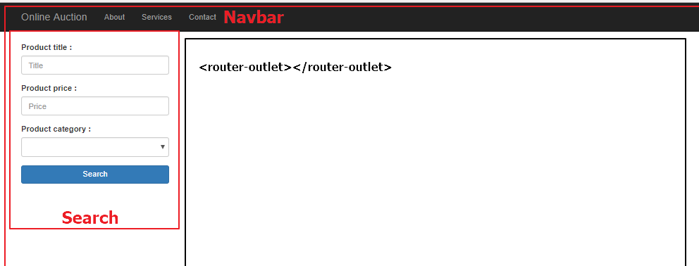

# ch03 라우터로 내비게이션 구현하기

- <a href="#3.1"> 3.1 라우터 </a>


<div id="3.1"></div>

## 3.1 라우터  
; 애플리케이션의 뷰 상태에 반응하는 객체로 이해해도 됨



- 캐러셀 컴포넌트와 상품 정보 컴포넌트를 HomeComponent에 포함되도록 리팩

### 3.1.1 위치 정책(Location strategy)  

- HashLocationStrategy (해시 기반 내비게이션 정책)  
URL에 해시 기호(#)를 사용해서 해시 기호 이후의 부분은 웹 페이지의 특정 부분을  
가리키도록 라우팅 하는 정책. 이 방식은 오래된 브라우저에서도 잘 동작.  
- PathLocationStrategy(방문 기록 API 기반 내비게이션 정책)  
브라우저의 방문 기록 API를 사용하는 정책이며, HTML5를 지원하는 브라우저에서만 동작한다.  
이 정책이 Angular 라우터의 기본 정책이다.

<br />

**해시 기반의 내비게이션**  

> http://mysite.com:8080/#/products/page/3

```
/products/page/3 :: 클라이언트 위치
/products/page/  :: 라우팅 경로
3                :: 라우팅 인자
```

**방문 기록 API 기반의 내비게이션**  
; API중 pushState() 함수를 사용하면 기본 URL 뒤에 SPA에서 사용하는 내비게이션 정보를 추가 할 수 있음.  
(e.g mysite.com:8080/products/page/3 => products/page/3 부분이 추가 된 정보)  
=> Angular에서는 URL과 컴포넌트를 매핑하면 됨  

- index.html 파일의 헤더에 <base href="/">과 같은 형식으로 <base> 태그 추가  
- Angular 루트 모듈의 providers 프로퍼티 값을 APP_BASE_HREF로 지정.  
```
import { APP_BASE_HREF } from '@angular/common';
...
@NgModule({
  ...
  providers : [{provide : APP_BASE_HREF, useValue : '/'}]
})
class AppModule {}
```

### 3.1.2 라우터 구성 요소
; @angular/router 패키지의 RouterModule 사용  

- Router : 라우터를 구현하는 객체. 원하는 경로로 이동하려면 이 객체의  
navigate() 함수와 navigateByUrl() 함수를 사용하거나, 라우터 객체의 path 프로퍼티 값을 변경하면 됨  
브라우저의 URL을 직접 수정해도 원하는 경로로 이동할 수 있음
- RouterOutlet : 라우터가 컴포넌트를 렌더링하는 영역인 <router-outlet>을 구현하는 디렉티브  
- Routes : 특정 URL에 연결되는 컴포넌트를 지정하는 배열  
- RouterLink : HTML 앵커 태그(&lt;a&gt;)의 원래 용도는 브라우저의 URL 주소를 변경하는 것이지만,  
RouterLink 디렉티브를 사용하면 앵커 태그가 Angular 라우터를 통하도록 기능을 변경할 수 있음  
RouterLink를 사용하면 라우터가 렌더링할 컴포넌트에 인자를 전달할 수 도 있음  
- ActivatedRoute : 현재 동작하는 라우터 인스턴스를 가리키는 객체  

> 라우터 설정
```
const routes : Routes = [
  { path : '', component : HomeComponent },
  { path : 'product', component : ProductDetailComponent}
]
```

> 루트 모듈에 라우터 추가  

```
import { BrowserModule } from '@angular/platform-browser';
import { RouterModule } from '@angular/router';
...
@NgModule({
  imports : [BrowserModule, RouterModule.forRoot(routes)],
  ...
})
```

> 기능 모듈에 라우터 추가  

```
import { CommonModule } from '@angular/common';
import { RouterModule } from '@angular/router';
...
@NgModule({
  imports : [BrowserModule, RouterModule.forChild(routes)],
  ...
})
```


<br /><br /><br /><br /><br /><br /><br /><br /><br /><br /><br /><br />
