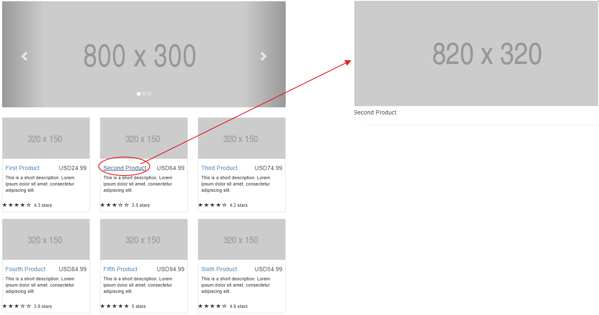

# ch03 라우터로 내비게이션 구현하기

- <a href="#3.1"> 3.1 라우터 </a>
- <a href="#3.2"> 3.2 라우터로 데이터 전달하기 </a>
- <a href="#3.3"> 3.3 자식 라우팅 </a>
- <a href="#3.4"> 3.4 라우팅 가드(Route Guards) </a>
- <a href="#3.5"> 3.5 라우팅 영역 여러개 만들기</a>
- <a href="#3.6"> 3.6 모듈 단위로 앱 나누기</a>
- <a href="#3.7"> 3.7 모듈 지연 로딩 </a>
- <a href="#3.8"> 3.8 실습 : 네비게이션 추가하기 </a>


<div id="3.1"></div>

## 3.1 라우터  
; 애플리케이션의 뷰 상태에 반응하는 객체로 이해해도 됨


- 캐러셀 컴포넌트와 상품 정보 컴포넌트를 HomeComponent에 포함되도록 리팩

### 3.1.1 위치 정책(Location strategy)  

- HashLocationStrategy (해시 기반 내비게이션 정책)  
URL에 해시 기호(#)를 사용해서 해시 기호 이후의 부분은 웹 페이지의 특정 부분을  
가리키도록 라우팅 하는 정책. 이 방식은 오래된 브라우저에서도 잘 동작.  
- PathLocationStrategy(방문 기록 API 기반 내비게이션 정책)  
브라우저의 방문 기록 API를 사용하는 정책이며, HTML5를 지원하는 브라우저에서만 동작한다.  
이 정책이 Angular 라우터의 기본 정책이다.

<br />

**해시 기반의 내비게이션**  

> http://mysite.com:8080/#/products/page/3

```
/products/page/3 :: 클라이언트 위치
/products/page/  :: 라우팅 경로
3                :: 라우팅 인자
```

**방문 기록 API 기반의 내비게이션**  
; API중 pushState() 함수를 사용하면 기본 URL 뒤에 SPA에서 사용하는 내비게이션 정보를 추가 할 수 있음.  
(e.g mysite.com:8080/products/page/3 => products/page/3 부분이 추가 된 정보)  
=> Angular에서는 URL과 컴포넌트를 매핑하면 됨  

- index.html 파일의 헤더에 <base href="/">과 같은 형식으로 <base> 태그 추가  
- Angular 루트 모듈의 providers 프로퍼티 값을 APP_BASE_HREF로 지정.  
```
import { APP_BASE_HREF } from '@angular/common';
...
@NgModule({
  ...
  providers : [{provide : APP_BASE_HREF, useValue : '/'}]
})
class AppModule {}
```

### 3.1.2 라우터 구성 요소
; @angular/router 패키지의 RouterModule 사용  

- Router : 라우터를 구현하는 객체. 원하는 경로로 이동하려면 이 객체의  
navigate() 함수와 navigateByUrl() 함수를 사용하거나, 라우터 객체의 path 프로퍼티 값을 변경하면 됨  
브라우저의 URL을 직접 수정해도 원하는 경로로 이동할 수 있음
- RouterOutlet : 라우터가 컴포넌트를 렌더링하는 영역인 <router-outlet>을 구현하는 디렉티브  
- Routes : 특정 URL에 연결되는 컴포넌트를 지정하는 배열  
- RouterLink : HTML 앵커 태그(&lt;a&gt;)의 원래 용도는 브라우저의 URL 주소를 변경하는 것이지만,  
RouterLink 디렉티브를 사용하면 앵커 태그가 Angular 라우터를 통하도록 기능을 변경할 수 있음  
RouterLink를 사용하면 라우터가 렌더링할 컴포넌트에 인자를 전달할 수 도 있음  
- ActivatedRoute : 현재 동작하는 라우터 인스턴스를 가리키는 객체  

> 라우터 설정
```
const routes : Routes = [
  { path : '', component : HomeComponent },
  { path : 'product', component : ProductDetailComponent}
]
```

> 루트 모듈에 라우터 추가  

```
import { BrowserModule } from '@angular/platform-browser';
import { RouterModule } from '@angular/router';
...
@NgModule({
  imports : [BrowserModule, RouterModule.forRoot(routes)],
  ...
})
```

> 기능 모듈에 라우터 추가  

```
import { CommonModule } from '@angular/common';
import { RouterModule } from '@angular/router';
...
@NgModule({
  imports : [BrowserModule, RouterModule.forChild(routes)],
  ...
})
```

### 3.1.3 navigate() 함수 사용하기

- 기존 : AppComponent 템플릿의 HTML 앵커태그에 routerLink를 추가해서 Angular  
내비게이션 연결  
- 사용자의 클릭 동작 없이 코드로 화면을 전환?

> 버튼 클릭 시 '/product'  
main-navigate.ts


**404에러 처리**  
=> 맨 마지막에 위치 시키면, 맨 마지막 조건을 만족

```
[
  { path : '', component : HomeComponent },
  { path : 'product', component : ProductDetailComponent },
  { path : '**', component : _404Component}
]
```

---

<div id="3.2"> </div>

## 3.2 라우터로 데이터 전달하기

### 3.2.1 ActivatedRoute에서 라우팅 인자 추출하기

> product-param.components, main-param.ts  

1. 라우터를 설정하기 위해 컴포넌트 템플릿에 있는 routerLink를 확인  
```<a [routerLink]="['/product', 1234]">Product Details</a>,```  
2. routerLink에 지정된 URL을 파싱하고 주어진 값으로 라우팅 인자를 치환  
3. 브라우저가 처리할 수 있도록 ```<a href="">``` 태그를 구성

> code

```
...
const routes : Routes = [
    { path : '', component : HomeComponent },
    // 라우팅 주소에 '/:id' 추가
    { path : 'product/:id', component : ProductDetailComponentParam }
];

@Component({
    selector : 'app',
    // routerLink에 전달되는 배열의 항목은 2개
    // '/product' :: 라우팅 주소, 1234 :: 상품의 ID
    template : `
        <a [routerLink]="['/']">Home</a>,        
        <a [routerLink]="['/product', 1234]">Product Details</a>,
        <router-outlet></router-outlet>
    `
})
class AppComponent {}
...
```

> HTML 코드  

```
...
<a ng-reflect-router-link="/product,1234" href="#/product/1234">Product Details</a>
....
```

### 3.2.2 라우터로 정적 데이터 전달하기
; 데이터는 부모 컴포넌트에서 자식 컴포넌트로 전달할 수 있지만, 라우터를 설정하는 시점에  
컴포넌트로 데이터를 전달할 수 있음 => 라우터 설정에 data 프로퍼티 사용

```
{ path : 'product/:id', component : ProductDetailComponentParam, data : [{isProd : true}] }
```

> product-param-data.component.ts, main-param-data.ts

---

<div id="3.3"> </div>

## 3.3 자식 라우팅
; Angular APP는 부모-자식 관계로 구성된 컴포넌트의 집합  
=> 각 컴포넌트는 캡슐화 되기 때문에 원하는 동작은 컴포넌트 안에서 모두 구현 등등  

> main-child.ts , product-child.component.ts , product-description.component.ts, seller.component.ts

---

## 3.4 라우팅 가드(Route Guards)
; 사용자가 라우터를 통해 들어오거나 나갈 떄 유효성을 검증하고 검증 결과를  
라우터에 반영  

- 사용자가 인증을 한 후에만 라우팅을 수행하고, 인증을 하지 않았다면 인증을 하게 함  
- 컴포넌트 몇 개로 만든 폼을 화면에 표시 & 이 폼에 유효한 데이터를 입력한 경우에만 내비게이션을 허용
- 라우터에서 빠져나갈 때 저장히자 않은 정보가 있는 것을 사용자에게 알림


> CanActive 인터페이스  

=> canActive() 함수를 통해 유효성을 검증해 true, false 값을 반환  

> CanDeActive 인터페이스  

=> canDeActive() true를 통해 라우터 내비게이션을 벗어날 수 있음  

> 라우팅 차단 test & 라우터를 벗어날 때 핸들링
main-with-guard.ts , guards/login.guard.js, guards/unsaved_changes.guard.ts

---

<div id="3.5"></div>

## 3.5 라우팅 영역 여러개 만들기  

> 활용예제  

- Gmail에서 받은 편지함 + 새로운 메일 쓰기
- 대시보드 SPA에서 각 영역에 하나 이상의 컴포넌트를 동시에 렌더링
- SPA에서 현재 화면에 접속한 사용자들과 대화하는 기능 등등

```
<router-outlet></router-outlet>
<router-outlet name="chat"></router-outlet>
```

> 라우팅 영역을 추가하고 채팅 뷰를 렌더링  
=> main_aux.ts

---

<div id="3.6"> </div>

## 3.6 모듈 단위로 앱 나누기
; Angular 애플리케이션은 특정 기능을 제공하는 모듈을 불러와 사용  
e.g) AppModule, BrowserModule, RouterModule ..  
=> 기능 모듈은 필요한 컴포넌트, 서비스, 다른 리소스를 묶어 개별폴더로  
관리하는 것을 권장

```
@NgModule({
    imports : [BrowserModule, RouterModule.forRoot(routes)],
    ...
})
class AppModule{}

platformBrowserDynamic().bootstrapModeul(AppModule);
```

> Exmaple  
main-luxury.ts , components/luxury/luxury.module.ts, components/luxury/luxury.component.ts

- 고급 상품 판매를 중단 ?  
=> 루트 모듈에 사용한 LuxuryModule을 빼고, AppComponent의 해당 링크 삭제  
- 고급 상품 판매 기능 추가도 간편히 적용

---

<div id="3.7"></div>

## 3.7 모듈 지연 로딩 (lazy loading)
; 모듈이 필요할 때 따로 내려 받는 것  

> Eg) 고급 상품 페이지를 지연로딩으로 변경  
main-luxury-lazy.ts , components/luxury/luxury.lazy.module.ts  

=> 애플리케이션의 인지 성능(perceived performance)을 높일 수 있음  
(사용자가 느끼는 애플리케이션의 동작 속도)

---

<div id="3.8"></div>

## 3.8 실습 : 네비게이션 추가하기

> 진행 순서  

1. 상품의 상세 정보를 표시하는 ProductDetailComponent 구현
2. HomeComponent 코드를 리팩토링해서 캐러셀을 캡슐화하고 페이지 레이아웃을  
그리드로 정리
3. products 주소에 대한 라우터를 설정할 때, 상품 이름을 사용.  
ProductDetailComponent 는 ActivatedRoute 객체에서 상품의 이름을 받아  
화면에 표시
4. ApplicationComponent에 라우팅 영역을 추가하고, 이 영역에 HomeComponent나  
ProductDetailComponent를 렌더링  
5. ProductItemComponent 템플릿에 있는 <a> 태그에 [routerLink] 디렉티브를 추가하고  
사용자가 상품의 이름을 클릭하면 상품 상세 정보로 라우팅  



---

## Summary  

- 라우터는 모듈에서 설정
- 라우터는 주소와 컴포넌트를 매핑  
- 라우터와 연결된 컴포터는가 렌더링되는 위치는 컴포넌트  
템플릿에서 <router-outlet> 태그로 지정  
- routerLink는 라우터 이름을 지정해서 사용할 수 도 있다
- navigate() 함수를 사용할 때도 라우터 이름을 지정할 수 있다
- 라우터를 통해 인자를 전달하려면 라우터 설정의 path 프로퍼티가 인자를 받도록  
지정해야 하며(path : 'product/:id'), 이 값은 routerLink나 navigate() 함수를  
사용할 때 전달
- 라우터를 통해 인자를 받으려면, 인자를 받는 컴포넌트의 생성자에 ActivatedRoute를  
의존성으로 주입하고 이 객체를 통해 값을 참조해야 한다
- 라우터를 여러 계층으로 구성하려면 Routes 인터페이스를 정의할 때 children 프로퍼티로  
지정  
- 라우터에 이름을 지정해서 사용하면 여러 개의 라우터를 동시에 사용할 수 있다.
- 모듈 지연 로딩을 사용하면 애플리케이션이 처음 실행 될 때 필요한 코드의 양을 최소화  
할 수 있고, 이 모듈은 필요한 시점에 서버에서 내려받아 APP에 불러올 수 있음
