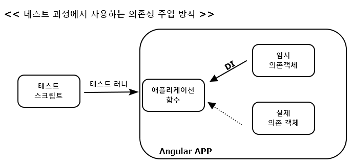
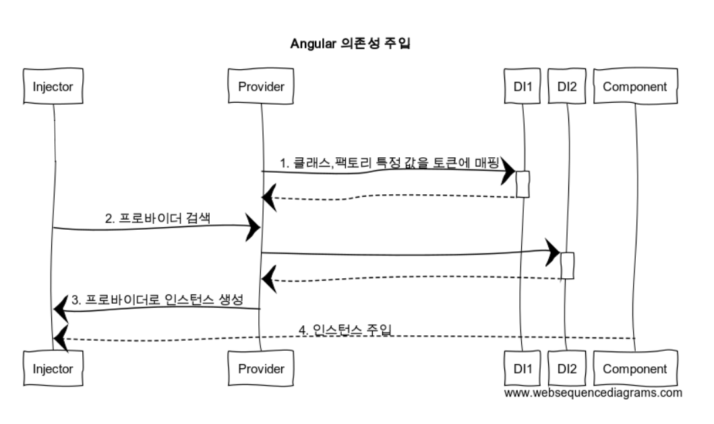
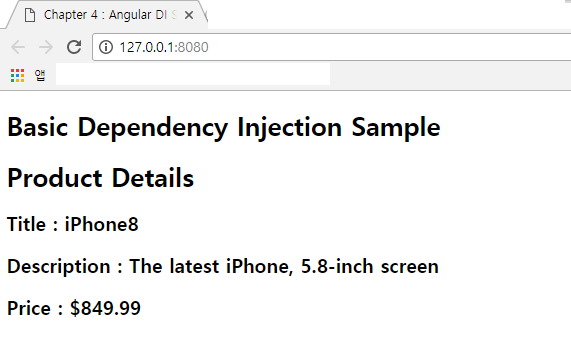
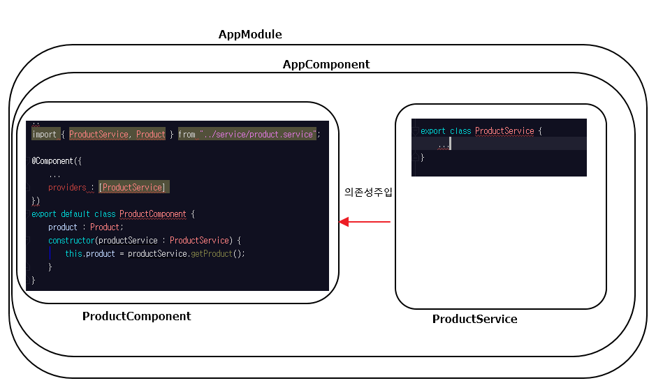
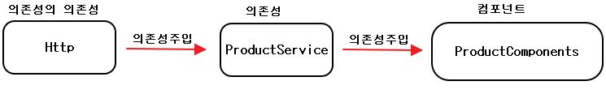

# ch04. 의존성 주입

- <a href="#4.1">4.1 의존성 주입과 제어권 역전</a>
- <a href="#4.2">4.2 인젝터와 프로바이더</a>
- <a href="#4.3">4.3 의존성 주입 예제</a>


## 이장에서 다루는 내용
- 의존성 주입 디자인 패턴
- 의존성 주입 패턴의 장점
- Angular 프레임워크에서 제공하는 의존성 주입 방식
- 프로바이더를 등록하고 인젝터로 사용하는 방법
- 인젝터 계층 구조
- 온라인 경매 애플리케이션에 의존성 주입 적용하기

---

<div id="4.1"></div>  

## 4.1 의존성 주입과 제어권 역전

### 4.1.1 의존성 주입(DI,Dependency Injection) 패턴  

> 상품을 배송하는 물류 센터

```
const product = new Product();
createShipment(product);
```

*다른 함수로 분리해 결합도를 낮추지만, 한 파일 안에 있다면?*  
*createShipment() 함수가 상품, 배송회사, 물류센터의 정보를 인자로 갖으면?*  
=> 전달되는 객체가 변경될 때 마다, 이 함수의 코드도 계속해서 수정되어야 할 것  
=> 객체 A가 객체 B에 의존성이 있다고 할 때, 객체 A는 인스턴스를 직접 생성하는 대신  
외부에서 생성!

### 4.1.2 제어권 역전(Inversion of Control) 패턴  
; 프레임 워크가 객체를 만들고 애플리케이션에 전달하는 방식  
[ref-toby-spring](https://github.com/zacscoding/spring-example/blob/master/book/toby/toby_spring_vol1/chap01.%EC%98%A4%EB%B8%8C%EC%A0%9D%ED%8A%B8%EC%99%80%EC%9D%98%EC%A1%B4%EA%B4%80%EA%B3%84/1.4.%EC%A0%9C%EC%96%B4%EC%9D%98%20%EC%97%AD%EC%A0%84(IoC).md)

### 4.1.3 의존성 주입의 장점  
; Angular에서는 의존성으로 주입되는 객체를 미리 프로바이더에 등록하고, 필요할 때  
인스턴스를 생성해서 제공하는 방식  
=> 코드의 결합도를 낮출 수 있고, 원하는 코드만 떼어내서 테스트할 수 있고, 재사용하기 쉬운  
코드를 작성할 수 있음

**낮은 결합도와 재사용성**  
ProductComponent가 ProductService에서 상품 정보를 받아오면 ?  
=> ProductComponent는 ProductService 클래스를 어떻게 생성하는지 직접 알아야 함  
(new, singleton, factory, etc...)  
=> 다른 APP에서 ProductComponent를 재사용 + 상품 정보는 다른 서비스에서 받아오면,  
ProductComponent 코드는 반드시 수정 되어야 함

> 의존성 주입 패턴을 사용하는 ProductComponent  

```
@Component({
    providers : [ProductService]
    // == providers : [{provide : ProductService, useClass : ProductService}]
    // ProductService 토큰을 사용
})
class ProductComponent {
  product : Product;
  constructor(productService : ProductService) {
    this.product = productService.getProduct();
  }
}
```

> 다른 APP에 ProductComponent 재사용 & ProductService 타입을 다른 클래스로 사용?

```
...
  providers : [{provide : ProductService, useClass : AnotherProductService}]
...
```

**테스트 가용성**  
상황 : APP에 로그인 기능 추가 -> LoginComponent는 ID와 비밀번호를 입력받는 화면  
제공 -> LoginService를 사용해 서버로부터 인증을 받아 사용자의 권한을 확인.  
=> LoginService에 mock object 생성 & 테스트 진행  
=> 추후 LoginService가 완성되면 providers를 수정하여 의존성 주입



---

<div id="4.2"> </div>  

## 4.2 인젝터와 프로바이더

- 루트 인젝터(root injector) : 전체 모듈에서 사용  
- 인젝터(injectors) : 컴포넌트에서 객체나 기본형 변수, 컴포넌트 서비스를 주입받으려면  
컴포넌트 안에도 인젝터를 따로 만듬  
- 프로바이더(providers) : 인젝터가 무엇을 주입해야 할지 알려주기 위해 사용  

> Note  

- 애플리케이션 실행과 동시에 로드되는 모듈은 인젝터를 따로 갖고 있지 않을 수도 있지만,  
지연 로딩된 모듈은 보조 인젝터(sub-root injector)를 만들어 사용  
- AngularJS와 다르게 Angular는 생성자의 인자로면 의존성을 주입할 수 있음  
=> 컴포넌트 클래스 생성자에 인자가 없으면, 의존성 주입 X  

> E.g ProductComponent ProductService

```
@NgModule({
  ...
  // AppModule이 부트스트랩될 때부터 모듈 전체에 반영
  providers : [{provide : ProductService, useClass : ProductService}]
  // == providers : [ProductService] // 토큰이름과 클래스 이름이 같으면  
})
```

```
@Component({
  ...
  providers : [ProductService]    
  // 컴포넌트의 코드가 로드되는 시점에는 ProductService의 인스턴스가 생성 된 것 X  
  // => 프로바이더는 인젝터에게 "언젠가 ProductService라는 타입의 객체를 인자로 받는
  // 생성자를 만나 이 객체의 인스턴스를 생성할 필요가 있을 때 여기에 등록 된 클래스를 사용"
})
```

**TypeScript와 ES6의 의존성 주입 비교**  

``` constructor(productService : ProductService) ```  
=> TypeScript 컴파일러 옵션에 emitDecoratorMetadata : true로 설정  
=> Angular가 주입되는 객체에 대한 메타데이터를 자동으로 생성  
=> SystemJS를 사용하고 TypeScript를 실시간으로 변환하는 환경에서는 이 옵션을  
system.config.js에 추가  
```
typeScriptOptions : {
  "emitDecoratorMetadata" : true
}
```

```constructor(@Inject(ProductService) productService)```  
=> ES6 문법으로 작성한다면 생성자에 인자를 주입할 때 @Inject어노테이션을 이용하여  
타입을 명시  

**의존성 주입 과정**  



### 4.2.1 프로바이더 등록하기  
;provide 프로퍼티가 있는 객체를 모아 배열로 선언하고, 이 배열을 모듈이나  
컴포넌트의 providers 프로퍼티 값으로 지정하면 됨  
- providers : 프로바이더를 등록하는 어노테이션 프로퍼티  
- provide : 개별 프로바이더에 사용하는 프로퍼티  

```[{provide : ProductService, useClass : MockProductService}]```  
=> ProductService 토큰이 의존성으로 주입될 때 MockProductService 클래스를 사용해서  
인스턴스를 생성하라는 의미  
=> 프로바이더에 지정하는 값은 클래스, 팩토리 함수, 문자열, OpaqueToken 클래스가 될 수 있음  

- 인젝터가 클래스를 직접 사용하도록 매핑할 때는 useClass 프로퍼티 사용  
- 조건을 판단하기 위해 팩토리 함수를 사용할 때는, useFactory 프로퍼티를 사용해서 팩토리  
함수를 지정. 이 팩토리 함수는 인자를 받을 수도 있음
- URL을 지정할 때와 같이 문자열을 간단하게 매핑할 때는 useValue 프로퍼티를 사용  

---

<div id="4.3"> </div>

## 4.3 의존성 주입 예제

### 4.3.1 상품 서비스 주입하기  

```main-basic.ts, service/product.service.ts, components/product.components.ts```

> 의존성 주입 예제



> ProductComponent에 ProductService 주입




### 4.3.2 HTTP 서비스 주입하기  
; ProductService가 HTTP 요청을 보내려면, Http 객체를 의존성으로 갖고 있어야 함  
=> Http 객체를 정의하고 있는 HttpModule을 불러와 사용 & ProductService의 생성자에  
Http 타입을 명시  

> 클래스에 주입되는 객체도 스스로 의존성을 가지는 예




<br /><br /><br /><br /><br /><br /><br /><br /><br /><br /><br /><br />
