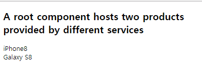
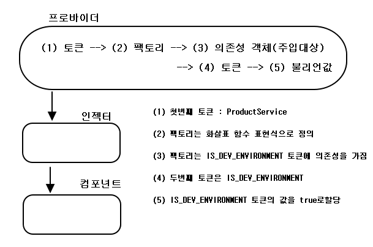
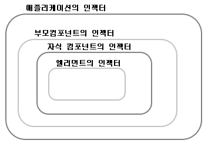
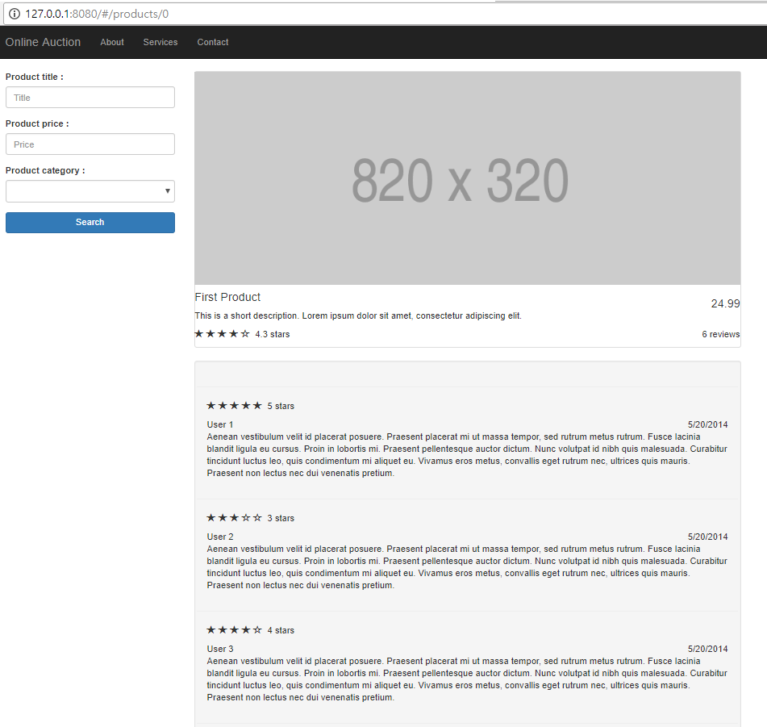
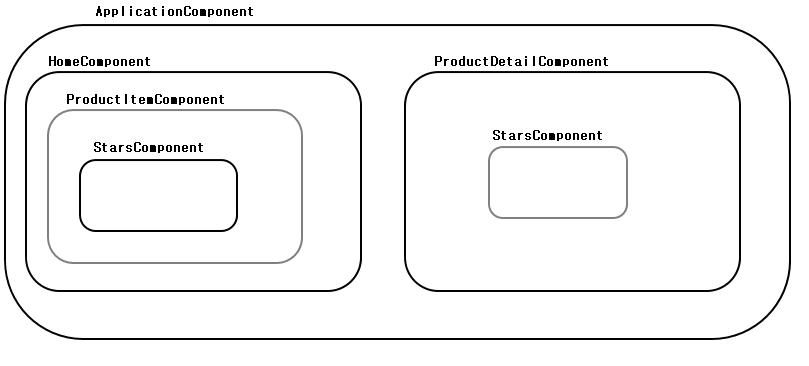

# ch04. 의존성 주입

- <a href="#4.1">4.1 의존성 주입과 제어권 역전</a>
- <a href="#4.2">4.2 인젝터와 프로바이더</a>
- <a href="#4.3">4.3 의존성 주입 예제</a>
- <a href="#4.4">4.4 프로바이더 변경하기  </a>
- <a href="#4.5">4.5 인젝터의 계층 구조</a>
- <a href="#4.6">4.6 실습 : 의존성 주입 패턴 확인하기</a>
- <a href="#4.7">4.7 정리</a>

## 이장에서 다루는 내용
- 의존성 주입 디자인 패턴
- 의존성 주입 패턴의 장점
- Angular 프레임워크에서 제공하는 의존성 주입 방식
- 프로바이더를 등록하고 인젝터로 사용하는 방법
- 인젝터 계층 구조
- 온라인 경매 애플리케이션에 의존성 주입 적용하기

---

<div id="4.1"></div>  

## 4.1 의존성 주입과 제어권 역전

### 4.1.1 의존성 주입(DI,Dependency Injection) 패턴  

> 상품을 배송하는 물류 센터

```
const product = new Product();
createShipment(product);
```

*다른 함수로 분리해 결합도를 낮추지만, 한 파일 안에 있다면?*  
*createShipment() 함수가 상품, 배송회사, 물류센터의 정보를 인자로 갖으면?*  
=> 전달되는 객체가 변경될 때 마다, 이 함수의 코드도 계속해서 수정되어야 할 것  
=> 객체 A가 객체 B에 의존성이 있다고 할 때, 객체 A는 인스턴스를 직접 생성하는 대신  
외부에서 생성!

### 4.1.2 제어권 역전(Inversion of Control) 패턴  
; 프레임 워크가 객체를 만들고 애플리케이션에 전달하는 방식  
[ref-toby-spring](https://github.com/zacscoding/spring-example/blob/master/book/toby/toby_spring_vol1/chap01.%EC%98%A4%EB%B8%8C%EC%A0%9D%ED%8A%B8%EC%99%80%EC%9D%98%EC%A1%B4%EA%B4%80%EA%B3%84/1.4.%EC%A0%9C%EC%96%B4%EC%9D%98%20%EC%97%AD%EC%A0%84(IoC).md)

### 4.1.3 의존성 주입의 장점  
; Angular에서는 의존성으로 주입되는 객체를 미리 프로바이더에 등록하고, 필요할 때  
인스턴스를 생성해서 제공하는 방식  
=> 코드의 결합도를 낮출 수 있고, 원하는 코드만 떼어내서 테스트할 수 있고, 재사용하기 쉬운  
코드를 작성할 수 있음

**낮은 결합도와 재사용성**  
ProductComponent가 ProductService에서 상품 정보를 받아오면 ?  
=> ProductComponent는 ProductService 클래스를 어떻게 생성하는지 직접 알아야 함  
(new, singleton, factory, etc...)  
=> 다른 APP에서 ProductComponent를 재사용 + 상품 정보는 다른 서비스에서 받아오면,  
ProductComponent 코드는 반드시 수정 되어야 함

> 의존성 주입 패턴을 사용하는 ProductComponent  

```
@Component({
    providers : [ProductService]
    // == providers : [{provide : ProductService, useClass : ProductService}]
    // ProductService 토큰을 사용
})
class ProductComponent {
  product : Product;
  constructor(productService : ProductService) {
    this.product = productService.getProduct();
  }
}
```

> 다른 APP에 ProductComponent 재사용 & ProductService 타입을 다른 클래스로 사용?

```
...
  providers : [{provide : ProductService, useClass : AnotherProductService}]
...
```

**테스트 가용성**  
상황 : APP에 로그인 기능 추가 -> LoginComponent는 ID와 비밀번호를 입력받는 화면  
제공 -> LoginService를 사용해 서버로부터 인증을 받아 사용자의 권한을 확인.  
=> LoginService에 mock object 생성 & 테스트 진행  
=> 추후 LoginService가 완성되면 providers를 수정하여 의존성 주입


---

<div id="4.2"> </div>  

## 4.2 인젝터와 프로바이더

- 루트 인젝터(root injector) : 전체 모듈에서 사용  
- 인젝터(injectors) : 컴포넌트에서 객체나 기본형 변수, 컴포넌트 서비스를 주입받으려면  
컴포넌트 안에도 인젝터를 따로 만듬  
- 프로바이더(providers) : 인젝터가 무엇을 주입해야 할지 알려주기 위해 사용  

> Note  

- 애플리케이션 실행과 동시에 로드되는 모듈은 인젝터를 따로 갖고 있지 않을 수도 있지만,  
지연 로딩된 모듈은 보조 인젝터(sub-root injector)를 만들어 사용  
- AngularJS와 다르게 Angular는 생성자의 인자로면 의존성을 주입할 수 있음  
=> 컴포넌트 클래스 생성자에 인자가 없으면, 의존성 주입 X  

> E.g ProductComponent ProductService

```
@NgModule({
  ...
  // AppModule이 부트스트랩될 때부터 모듈 전체에 반영
  providers : [{provide : ProductService, useClass : ProductService}]
  // == providers : [ProductService] // 토큰이름과 클래스 이름이 같으면  
})
```

```
@Component({
  ...
  providers : [ProductService]    
  // 컴포넌트의 코드가 로드되는 시점에는 ProductService의 인스턴스가 생성 된 것 X  
  // => 프로바이더는 인젝터에게 "언젠가 ProductService라는 타입의 객체를 인자로 받는
  // 생성자를 만나 이 객체의 인스턴스를 생성할 필요가 있을 때 여기에 등록 된 클래스를 사용"
})
```

**TypeScript와 ES6의 의존성 주입 비교**  

``` constructor(productService : ProductService) ```  
=> TypeScript 컴파일러 옵션에 emitDecoratorMetadata : true로 설정  
=> Angular가 주입되는 객체에 대한 메타데이터를 자동으로 생성  
=> SystemJS를 사용하고 TypeScript를 실시간으로 변환하는 환경에서는 이 옵션을  
system.config.js에 추가  
```
typeScriptOptions : {
  "emitDecoratorMetadata" : true
}
```

```constructor(@Inject(ProductService) productService)```  
=> ES6 문법으로 작성한다면 생성자에 인자를 주입할 때 @Inject어노테이션을 이용하여  
타입을 명시  

**의존성 주입 과정**  


### 4.2.1 프로바이더 등록하기  
;provide 프로퍼티가 있는 객체를 모아 배열로 선언하고, 이 배열을 모듈이나  
컴포넌트의 providers 프로퍼티 값으로 지정하면 됨  
- providers : 프로바이더를 등록하는 어노테이션 프로퍼티  
- provide : 개별 프로바이더에 사용하는 프로퍼티  

```[{provide : ProductService, useClass : MockProductService}]```  
=> ProductService 토큰이 의존성으로 주입될 때 MockProductService 클래스를 사용해서  
인스턴스를 생성하라는 의미  
=> 프로바이더에 지정하는 값은 클래스, 팩토리 함수, 문자열, OpaqueToken 클래스가 될 수 있음  

- 인젝터가 클래스를 직접 사용하도록 매핑할 때는 useClass 프로퍼티 사용  
- 조건을 판단하기 위해 팩토리 함수를 사용할 때는, useFactory 프로퍼티를 사용해서 팩토리  
함수를 지정. 이 팩토리 함수는 인자를 받을 수도 있음
- URL을 지정할 때와 같이 문자열을 간단하게 매핑할 때는 useValue 프로퍼티를 사용  

---

<div id="4.3"> </div>

## 4.3 의존성 주입 예제

### 4.3.1 상품 서비스 주입하기  

```main-basic.ts, service/product.service.ts, components/product.components.ts```

> 의존성 주입 예제


> ProductComponent에 ProductService 주입


### 4.3.2 HTTP 서비스 주입하기  
; ProductService가 HTTP 요청을 보내려면, Http 객체를 의존성으로 갖고 있어야 함  
=> Http 객체를 정의하고 있는 HttpModule을 불러와 사용 & ProductService의 생성자에  
Http 타입을 명시  

> 클래스에 주입되는 객체도 스스로 의존성을 가지는 예


> ProductService에 Http 객체 주입 & Http객체를 이용해 product.json 파일에 있는  
상품 정보를 불러오는 코드

```
import { Http } from '@angular/http';
import { Injectable } from '@angular/core';

@Injectable()
export class ProductService {
  constructor(private http : Http) {
    const products = http.get('package.json');
  }
  // 필요한 코드는 계속 구현
}
```

> Http 객체의 프로바이더는 HttpModule에서 다양한 형태로 정의  
=> APP에서 HttpModule을 불러와 사용

```
import { HttpModule } from '@angular/http';
...

@NgModule({
  imports : [
    BrowserModule,
    HttpModule
  ],
  declarations : [AppComponent],
  bootstrap : [AppComponent]
})
export class AppModule {}
```

---

<div id="4.4"> </div>

## 4.4 프로바이더 변경하기  

=> ProductService가 구현되지 않았다면?  
1) ProductService에 하드코딩으로 임시 정보를 추출  
2) MockProductService 생성  


> Ex) 서로 다른 서비스를 사용해 상품 정보 렌더링  
main-change-provider.ts



```
class MockProductService implements ProductService {
    getProduct(): Product {
        return new Product('Galaxy S8');
    }
}
```

=> TypeScript에서 클래스를 인터페이스로 사용가능 <br />


```
@NgModule({
    imports : [BrowserModule],
    // 애플리케이션 계층의 인젝터에 ProductService 프로바이더를 등록
    providers : [ProductService],
    declarations : [AppComponent, Product1Component, Product2Component],
    bootstrap : [AppComponent]
})
class AppModule{}

@Component({
    selector : 'product1',
    template : '{{ product.title }}'
})
class Product1Component {
    product : Product;
    // ProductService 의존성 주입
    constructor(private productService : ProductService) {
        this.product = productService.getProduct();
    }
}

@Component({
    selector : 'product2',
    template : '{{ product.title }}',
    // MockProductService 지정
    providers : [ {provide : ProductService, useClass : MockProductService}]
})
class Product2Component {
    product : Product;
    // 생성자의 코드를 변경할 필요X => MockProductService 의존성 주입
    constructor(private productService : ProductService) {
        this.product = productService.getProduct();
    }
}  
```  

=> Product1Component는 부모 계층에서 프로바이더 지정한 것 사용 & Product2Component는  
오버라이드하여 사용  

> 만약 ProductService를 임시로 사용하지 않으려면?  

```
@NgModule({
    ...    
    providers : [{provider:ProductService, useClass:MockProductService}],
    ...
})
```

### 4.4.1 프로바이더에 useFactory와 useValue 사용하기  

> main-factory.ts

```
@Component({
    ...
    providers : [{
        provide : ProductService,
        // 팩토리함수는 isDev 인자를 사용 & 이 값은 외부에서 주입
        useFactory : (isDev) => {
            if(isDev) {
                return new MockProductService();
            }
            else {
                return new ProductService();
            }
        },
        // deps : 팩토리 함수에서 사용하는 의존성 객체
        deps : ['IS_DEV_ENVIRONMENT']
    }],
    template : '{{ product.title }}'
})
class Product2Component {
    ...
}

@NgModule({
    ...
    // 고정 된 값을 IS_DEV_ENVIRONMENT 토큰으로 등록하려면, useValue를 사용해서 값을 지정
    providers : [ProductService, {provide : 'IS_DEV_ENVIRONMENT', useValue : false}],
    ...
})
class AppModule{}
```


> 팩토리를 프로바이더로 사용하는 과정  




### 4.4.2 불투명 토큰(OpaqueToken) 사용하기  
; IS_DEV_ENVIRONMENT와 같은 토큰을 사용할 경우, 다른 프로바이더의 이름과 겹치면 문제 발생 등  

> main-opaque-token.ts  

```
import { Component, OpaqueToken, Inject, NgModule } from '@angular/core';
import { platformBrowserDynamic } from '@angular/platform-browser-dynamic';
import { BrowserModule } from '@angular/platform-browser';

export const BackendUrl = new OpaqueToken('BackendUrl');

@Component({
    selector : 'app',
    template : 'URL : {{ url }}'
})
class AppComponent {
    constructor (@Inject(BackendUrl) public url) {
    }
}

@NgModule({
    imports : [BrowserModule],
    declarations : [AppComponent],
    providers : [{ provide : BackendUrl, useValue : 'myQAserver.com' }],
    bootstrap : [AppComponent]
})
class AppModule {}
```

---

<div id="4.5"> </div>

## 4.5 인젝터의 계층 구조
; Angular 애플리케이션은 컴포넌트의 계층으로 구성  
루트 인젝터를 사용해 애플리케이션 객체를 생성 & 이 인젝터는 생성된 애플리케이션의  
구조를 따라가면서 컴포넌트의 계층을 만들고 컴포넌트 인젝터를 생성  

> 인젝터의 계층 구조  



=> 컴포넌트가 생성될 때 의존성으로 주입되는 객체가 있으면, 컴포넌트의 인젝터는  
컴포넌트 계층에 프로바이더가 등록되어있는지 찾음  
=> 적절한 프로바이더가 존재하면, 그 프로바이더 사용  
=> 존재하지 않으면 부모 컴포넌트에 프로바이더를 찾음  
=> 끝까지 존재하지 않으면 에러 발생  

**지연 로딩모듈**  
지연 로딩 모듈을 사용하면, 인젝터를 추가로 생성  
=> 지연 로딩 모듈에 등록된 프로바이더는 해당 모듈 안에서만 사용  
모듈 밖에서는 사용X

> 4.4절에서 사용한 Example  

```
@Component({
    selector : 'product1',
    template : '{{ product.title }}'
})
class Product1Component {
    product : Product;
    // ProductService 의존성 주입
    constructor(private productService : ProductService) {
        this.product = productService.getProduct();
    }
}
...
@Component({
    selector : 'app',
    // 2개의 컴포넌트 랜더링
    template : `
        <h2>A root component hosts two products <br>
            provided by different services</h2>
        <product1></product1>
        <br/>
        <product2></product2>
    `
})
class AppComponent{}

@NgModule({
    imports : [BrowserModule],
    // 애플리케이션 계층의 인젝터에 ProductService 프로바이더를 등록
    providers : [ProductService],
    declarations : [AppComponent, Product1Component, Product2Component],
    bootstrap : [AppComponent]
})
class AppModule{}  
```

- Product1Component에서 프로바이더를 찾음. (이 계층에는 ProductService에  
  해당하는 프로바이더 X)
- 부모 컴포넌트인 AppComponent에서 프로바이더를 찾음 (여기에도 X)  
- 상위 모듈인 AppModule에서 프로바이더를 찾음. (여기에는 providers 등록 되어있음)
- 모듈 계층의 인젝터를 사용해서 ProductService 인스턴스 생성 & 이 인스턴스를 모듈 계층에 둠  
(앱 모듈이 애플리케이션이므로, 애플리케이션의 인젝터로 봐도 무방)  
- Product2Component의 경우 같은 토큰의 프로바이더가 존재하므로, 다른 인스턴스가 생성되어 주입  

### 4.5.1 viewProviders  
;자식 컴포넌트나 외부 컴포넌트를 배제하고, 등록하는 계층에서만 프로바이더를 사용하려면  
providers 프로퍼티 대신 viewProviders 프로퍼티를 사용  


```
<root>
  <product2>
    <luxury-product></luxury-product>
  </product2>
</root>
```

가정 : AppModule과 Product2Component는 각각 ProductService 토큰에 대한 프로바이더를 등록   

WTD : LuxuryProductComponent에서는 Product2Component에서 등록한 프로바이더를 사용하지 못하게 하기   
=> Product2Component에 사용한 providers 프로퍼티를 viewProviders로 변경  

---

<div id="4.6"> </div>

## 4.6 실습 : 의존성 주입 패턴 확인하기

#### ch3 auction review

> 상품 정보를 받아올 서비스의 프로바이더 : app.module.ts  

```
@NgModule({
    ...
    // ProductService 프로파이더 선언 -> ApplicationComponent에 주입될 때 사용
    providers : [ProductService,
        { provide : LocationStrategy, useClass : HashLocationStrategy}],
    bootstrap : [ApplicationComponent]
})
export class AppModule {}
```

> home.ts  

```
import { Component } from "@angular/core";
import { Product, ProductService } from "../../services/product.service";

@Component({
  selector : 'auction-home-page',
  styleUrls : ['app/components/home/home.component.css'],
  template : `
      <div class="row carousel-holder">
          <div class="col-md-12">
              <auction-carousel></auction-carousel>
          </div>
      </div>
      <div class="row">
          <div *ngFor="let product of products" class="col-sm-4 col-lg-4 col-md-4">
              <auction-product-item [product]="product"></auction-product-item>
          </div>
      </div>
  `
})
export default class HomeComponent {
    products : Product[] = [];

    constructor(private productService : ProductService) {
        this.products = this.productService.getProducts();
    }
}
```

=> ProductService 프로바이더는 앱 모듈에 등록 -> 모든 컴포넌트에서 사용 가능  
=> HomeComponent에서는 별도 등록 없이 ProductService를 주입  
=> HomeComponent가 생성되면 ProductService 인스턴스가 의존성으로 주입 &  
getProducts() 함수가 실행 된 후 상품 정보가 담긴 배열을 products 프로퍼티에 할당  
=> *ngFor 루프를 사용해 배열에 있는 항목의 개수만큼 <action-product-item> 컴포넌트를 생성  

> app/components/product-item/product-item.component.html  

```
<h4><a [routerLink]="['/products', product.title]">{{ product.title }}</a></h4>
```  

=> 링크 클릭 시 ProductDetailComponent 렌더링 & product.title 값을 인자로 전달  

### Auction preview  

  


### 4.6.1 라우터 인자를 상품 ID로 수정하기  

> product-item.component.html  

```
...
<h4><a [routerLink]="['/products', product.id]">{{ product.title }}</a></h4>
...
```

### 4.6.2 ProductDetailComponent 수정  

> ApplicationComponent 구조  

  

> app.module.ts   
product/:productId로 변경

```
@NgModule({
    imports : [BrowserModule,
        RouterModule.forRoot([
            {path : '', component : HomeComponent},
            {path : 'products/:productId', component : ProductDetailComponent }

        ])
    ...
```

> product-detail.component.ts  

```
import { Component } from "@angular/core";
import { ActivatedRoute } from "@angular/router";
import { Product, Review, ProductService } from "../../services/product.service";

@Component({
    selector : 'auction-product-page',
    templateUrl : 'app/components/product-detail/product-detail.component.html'
})
export default class ProductDetailComponent {
    product : Product;
    reviews : Review[]
    // ActivatedRoute와 ProductService 의존성 주입
    constructor (route : ActivatedRoute, productService : ProductService) {
        let prodId : number = parseInt(route.snapshot.params['productId']);
        this.product = productService.getProductById(prodId);
        this.reviews = productService.getReviewsForProduct(prodId);
    }
}
```

> product-detail.component.html  

```
<div class="thumbnail">
  
  <div>
    <h4 class="pull-right"> {{product.price}} </h4>
    <h4> {{product.title}} </h4>
    <p>{{product.description}}</p>
  </div>
  <div class="ratings">
    <p class="pull-right">{{reviews.length}} reviews</p>
    <p>
      <auction-stars [rating]="product.rating"></auction-stars>
    </p>
  </div>
</div>
<div class="well" id="reviews-anchor">
  <div class="row">
    <div class="col-md-12"></div>
  </div>
  <div class="row" *ngFor="let review of reviews">
    <hr>
    <div class="col-md-12">
      <auction-stars [rating]="review.rating"></auction-stars>
      <span>{{review.user}}</span>
      <!--
      파이프 연산자(|) 를 사용하면 값의 형식을 변환하는 필터 사용
      https://angular.io/api/common/DatePipe
      -->
      <span class="pull-right">{{review.timestamp | date : 'shortDate'}}</span>
      <p>{{ review.comment }}</p>
    </div>
  </div>
</div>
```  

> Product, Review 클래스  in product.service.ts

```
export class Product {
  constructor(public id: number,
              public title: string,
              public price: number,
              public rating: number,
              public description: string,
              public categories: Array<string>) {
  }
}

export class Review {
  constructor(public id: number,
              public productId: number,
              public timestamp: Date,
              public user: string,
              public rating: number,
              public comment: string) {

  }
}
```

> product.service.ts  

```
@Injectable()
export class ProductService {
  getProducts(): Array<Product> {
    return products.map(p => new Product(p.id, p.title, p.price, p.rating, p.description, p.categories));
  }

  getProductById(productId: number): Product {
    return products.find(p => p.id === productId);
  }

  getReviewsForProduct(productId: number): Review[] {
    return reviews
    .filter(r => r.productId === productId)
    .map(r => new Review(r.id, r.productId, new Date(r.timestamp), r.user, r.rating, r.comment));
  }
}
```  

**ES5로 컴파일할 때 ES6 API 사용하기**  
1) @types/es6-shim 패키지 사용  
```
-- package.json
"devDependencies": {
    "@types/es6-shim": "0.0.28",
    ..
-- tsconfig.json  
{
  "compilerOptions": {
    "experimentalDecorators": true,
    "emitDecoratorMetadata": true,
    "module": "commonjs",
    "target": "ES5",
    "noEmit": true,
    "types":["es6-shim"]
  },

  "exclude": [
    "node_modules"
  ]
}
```

2) TypeScript 컴파일러 옵션에 "lib" : ["es2015"] 추가  


---

<div id="4.7"></div>

## 4.7 정리  

- 의존성으로 주입될 객체는 프로바이더에 등록한다  
- 프로바이더에는 객체뿐 아니라 문자열도 사용할 수 있다
- 인젝터는 계층을 이루며 구성되고, 컴포넌트 계층에서 원하는 프로바이더를 찾지 못하면  
부모 계층의 인젝터를 따라 올라가며 프로바이더를 찾는다  
- providers 프로퍼티에 등록 된 객체는 자식 컴포넌트에서도 사용할 수 있지만  
viewProviders에 등록 된 객체는 그 프로바이더가 선언된 계층에서만 사용가능


<br /><br /><br /><br /><br /><br /><br /><br /><br /><br /><br /><br />
