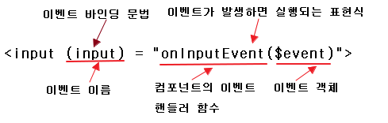
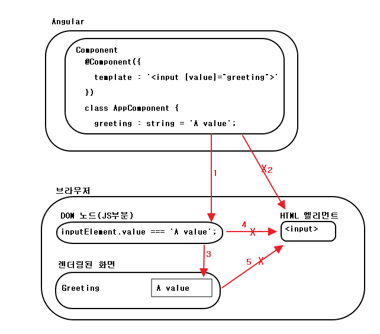
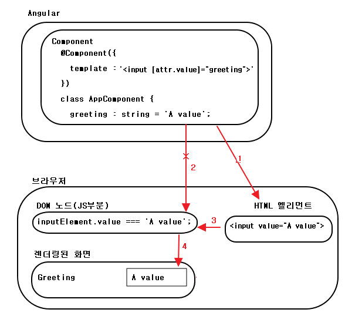
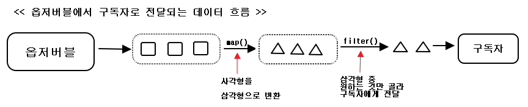

## CH05. 바인딩, 옵저버블, 파이프

### Intro

- 데이터 바인딩의 종류
- 어트리뷰트 바인딩 vs 프로퍼티 바인딩
- 이벤트를 옵저버블 데이터 스트림으로 처리하기
- 불필요한 HTTP 요청을 취소해서 네트워크 부하 줄이기
- 파이프 사용 방법

### Index

- <a href="#5.1">5.1 데이터 바인딩</a>
- <a href="#5.2">5.2 반응형 프로그래밍과 옵저버블</a>
- <a href="#5.3">5.3 파이프</a>


<div id="5.1"></div>

## 5.1 데이터 바인딩

```
<!-- 변수의 값이나 표현식의 결과를 템플릿에 문자열로 표시 -->
<h1>Hello {{name}}!</h1>
<!-- <span> 엘리먼트의 DOM 객체 프로퍼티와 컴포넌트 프로퍼티를 바인딩 -->
<span [hidden]="isValid">This field is required</span>
<!-- click 이벤트를 바인딩-->
<button (click)="placeBid()">Place Bid</button>
```

=> Angular에서 데이터 바인딩은 기본적으로 단방향  
(컴포넌트 프로퍼티에서 화면을 향하는 방향 or 화면에서 발생 한 이벤트가  
컴포넌트 메소드를 향하는 방향이라는 것을 의미)  

### 5.1.1 이벤트 바인딩  

> click 이벤트 -> onClickEvent() 함수  
/ input 이벤트 -> onInputEvent() 함수 연결예제

```
<button (click)="onClickEvent()">Get Products</button>
<input placeholder="Product name" (input)="onInputEvent()">
```



### 5.1.2 프로퍼티 바인딩, 어트리뷰트 바인딩  
; HTML 엘리먼트는 태그에 어트리뷰트를 지정하는 방식을 속성으로 추가할 수 있고,  
브라우저는 각 태그마다 DOM 객체를 생성하며 DOM 객체는 프로퍼티로 속성을 표현  

=> 브라우저는 HTML 엘리먼트를 DOM 객체(노드)로 만들고 이 DOM 객체를 웹 페이지에  
렌더링하는데, DOM 객체의 프로퍼티 값이 변경되면 그때마다 페이지를 다시 렌더링  

**프로퍼티 바인딩**  

> AppComponent 클래스의 변수인 greeting이 브라우저의 <input> 태그의  
프로퍼티에 바인딩 예제  

  


- (1) : 컴포넌트 클래스 변수(greeting)를 DOM 객체의 value 프로퍼티로 바인딩  
(브라우저가 HTML 엘리먼트를 렌더링 한 후 확인하면 InputHTMLElement 객체의 value  
프로퍼티 값이 'A value'로 할당)  
- (2) : HTML문서에 있는 input 엘리먼트의 어트리뷰트에는 컴포넌트 변수 greeting 값이  
반영되지 않음  
- (3) : DOM 노드의 value 프로퍼티가 화면에 표시. 컴포넌트 클래스 변수 greeting의 값이  
변경되면, Angular가 DOM 노드에 있는 value 프로퍼티를 갱신하고 브라우저는 새로운 값을  
렌더링해서 DOM과 화면을 동기화. (단방향이므로 `<input>` 태그의 값이 변경되어도 컴포넌트  
클래 변수 greeting 값이 변경되지 않음)
- (4) : DOM 노드의 value 프로퍼티가 변경되어 HTML 엘리먼트의 어트리뷰트 값은 변경되지 않음  
- (5) : 브라우저에서 사용자가 `<input>` 필드의 값을 변경해도 HTML 엘리먼트의 어트리뷰트 값은 변경X  
사용자가 보는 값은 DOM 객체에서 온 것 (HTML 문서에서 온 것 X)

**어트리뷰트 바인딩**  

```<input [attr.value]="greeting">```

  

- (1) : 컴포넌트의 클래스 변수인 greeting을 HTML 문서에 있는 엘리먼트 어트리뷰트로  
바인딩  (attr. 사용하는 것 잊지말기) => HTML문서에 있는 ```<input>```엘리먼트의  
value 어트리뷰트에 "A value"라는 속성이 지정  
- (2) : DOM 노드에는 컴포넌트 변수 greeting 값이 반영되지 않음  
- (3) : 화면에 표시되는 DOM 객체는 'A value'라는 값을 받게 됨. 브라우저가 HTML문서의  
엘리먼트와 DOM을 동기화 했기 때문(Angular 코드가 반영 된 것은X)  
- (4) : 브라우저는 화면과 DOM을 동기화하기 때문에 DOM 노드의 value 프로퍼티 값이 화면에 표시  


> Eg : app/bindings/attribute-vs-property.ts  

### 5.1.3 템플릿 바인딩  
=> HTML엘리먼트가 화면에 표시되는 것을 조작하려면, 엘리먼트의 hidden 어트리뷰트나  
display 스타일에 불리언 값을 바인딩(화면에 표시하거나 숨길 수 있지만, DOM 트리에는  
여전히 존재)
=> Angular는 NgIf, NgSwitch, NgFor와 같은 구조 디렉티브(structural directives)를 통해  
DOM 트리에 노드를 추가하거나 제거할 수 있음  

```
import {platformBrowserDynamic} from "@angular/platform-browser-dynamic";
import {NgModule, Component} from "@angular/core";
import {BrowserModule} from "@angular/platform-browser";

@Component({
  selector: 'app',
  template: `
    <button (click)="flag=!flag">Toggle flag's value</button>
    <p>
      Flag's value : {{ flag }}
    </p>
    <p>
      1. span with *ngIf="flag" : <span *ngIf="flag"> Flag is True</span>
    </p>
    <p>
      2. template with [ngIf]="flag" :
      <ng-template [ngIf]="flag">Flag is true</ng-template>
    </p>
  `
})
class AppComponent {
  flag: boolean = true;
}

@NgModule({
  imports: [BrowserModule],
  declarations: [AppComponent],
  bootstrap: [AppComponent]
})
class AppModule {
}

platformBrowserDynamic().bootstrapModule(AppModule);
```

### 5.1.4 양방향 데이터 바인딩
; 양방향 데이터 바인딩(Two-way data binding)을 사용하면 뷰(화면)과 모델(컴포넌트)  
을 간단하게 동기화 할 수 있음

> 이벤트 바인딩

```
<input (input)="onInputEvent($event)">
```

> 프로퍼티 바인딩  

```
<input [value]="myComponentProperty">
```

> 양방향 바인딩  

```
<input [value]="myComponentProperty" (input)="onInputEvent($event)>"
```

> Angular의 [()] 표기법 + NgModule 디렉티브  

```
<input [(ngModel)]="myComponentProperty">
```

> E.g app/bindings/two-way-bindings.ts

---

<div id="5.2"></div>

## 5.2 반응형 프로그래밍과 옵저버블
; 반응형 프로그래밍(Reactive Programming)은 옵저버블(Observables) 이벤트 스트림을  
구독(subscribe)하고, 이 스트림에 반응하는 방식으로 동작하는 애플리케이션  

### 5.2.1 옵저버와 옵저버블이 무엇인가?  

- 옵저버블 : 연속된 데이터 스트림을 생성하는 객체  
  - 콜드 옵저버블(cold observables) : 구독자가 있는 경우에만 스트리밍 데이터 생성  
  - 핫 옵저버블(hot observables) : 데이터를 받는 구독자가 없어도, 스트리밍 함  
- 옵저버 : 위 스트림을 구독해서 사용하는 객체  

> 옵저버블 객체로부터 스트림을 구독  

```
let mySubscription : Subscription = someObservable.subscribe(myObserver);
```

> 스트림 구독을 멈춤  

```
mySubscription.unscribe();
```

**옵저버블**  
; 소켓이나 배열, 화면에서 발생한 이벤트 등과 같은 데이터 소스를 한번에 하나씩,  
연속으로 보내는(스트리밍,streaming) 객체  
- 다음 엘리먼트를 전달
- 에러를 전달  
- 스트리밍이 종료되었다는 신호를 전달  

**옵저버**  
- 다음 엘리먼트를 받았을 때 처리하는 함수
- 에러를 받았을 때 처리하는 함수
- 데이터 스트림이 끝났을 때 실행하는 함수  




[link : reactivex.io/document/operators](http://reactivex.io/documentation/operators.html)

[link : Rx함수에 따른 구슬 다이어 그램](http://rxmarbles.com/)

### 5.2.2 옵저버블 이벤트 스트림  
; 이벤트는 Event 객체로 표현되며, 어디에서 어떤 이벤트가 발생했는지, 발생한  
이벤트에 대한 정보를 담고 있음  

```
template : `<input (keyup)="onKey($event)">`
...
onKey(event : any) {
  console.log('You have entered ' + event.target.value);
}
```  

=> event.target을 사용해 ```<input>``` 엘리먼트의 value 프로퍼티에 접근  

> Angular의 템플릿 지역변수 사용  

```
template : `<input #mySearchField (keyup)="onKey(mySearchField.value)">`
...
onKey(value : string) {
  console.log('You have entered ' + value);
}
```  

=> ```<input>``` 엘리먼트에 mySearchField 템플릿 지역 변수 지정  
& 이벤트 핸들러 함수에 Event 객체 대신 엘리먼트의 프로퍼티를 직접 전달  

=> JavaScript APP에서는 일반적으로 이벤트를 한번만 처리 BUT Angular에서는  
이벤트를 시간에 따라 연속적으로 발생하는 옵저버블 스트림으로 처리  

=> 구독자가 스트림을 구독하는 것은 스트림 발행자에게 스트림을 받고 싶다고 알리는 것  
(스트림을 구독하는 동안 스트림 엘리먼트를 받고 이에 반응해서 함수를 실행하며,  
에러를 처리하거나 스트림이 종료되었을 때 필요한 동작도 할 수 있음 + subscribe() 함수를  
통해 다른 함수를 체이닝 가능)  

> E.G  

```
<input type='text' (keyup)="getStockPrice($event)">
```  

=> keyup이벤트가 발생할 때 마다 getStockPrice() 함수를 실행  
=> A, AA, AAP, AAPL 이 입력되는동안 4번 서버로 요청을 보냄  
=> 불필요한 요청을 제어하기 위해 setTimeout() 함수를 사용 할 수 있음  
=> BUT AAP까지 입력하고, 특정 time이 지난 뒤 AAPL을 입력하면 ?  
=> AAP까지의 파라미터값을 기준으로 서버로 요청 & 다음 time 까지 기다림  

> 옵저버블 EG : observables/observable-event.ts

```
import {platformBrowserDynamic} from "@angular/platform-browser-dynamic";
import {NgModule, Component} from "@angular/core";
import {BrowserModule} from "@angular/platform-browser";
import {FormControl, ReactiveFormsModule} from "@angular/forms";
// rxjs/Rx를 이용해 모든 함수를 불러오거나 특정 함수를 지정
// => 애플리케이션 최적화를 위해 사용하는 함수만 불러오는 게 좋음
import 'rxjs/add/operator/debounceTime';

@Component({
  selector: 'app',
  // <input> 엘리먼트는 컴포넌트 프로퍼티 searchInput으로 바인딩되서 폼 컨트롤로 동작
  template: `
    <h2>Observable events demo</h2>
    <input type="text" placeholder="Enter stock" [formControl]="searchInput">
  `
})
class AppComponent {
  searchInput: FormControl = new FormControl('');

  constructor() {
    this.searchInput.valueChanges
    // <input> 엘리먼트는 다음 이벤트를 바로 발생시지 않고 500MS 지연
    .debounceTime(500)
    // 옵저버블 스트림을 구독
    .subscribe(stock => this.getStockQuoteFromServer(stock));
  }

  getStockQuoteFromServer(stock: string) {
    console.log(`The price of ${stock} is ${100 * Math.random().toFixed(4) }`);
  }
}

@NgModule({
  // 반응형 폼 모듈을 앱 모듈에 불러옴
  imports: [BrowserModule, ReactiveFormsModule],
  declarations: [AppComponent],
  bootstrap: [AppComponent]
})
class AppModule {
}

platformBrowserDynamic().bootstrapModule(AppModule);
```

### 5.2.3 옵저버블 취소하기  
; 옵저버블이 Promise 보다 좋은 점은 동작이 완료되기 전에 취소할 수 있음  

***가정*** : 상품 목록 중 하나를 클릭하여 상세 정보를 받아올 때,  상세 정보 요청 후  
다른 제품을 요청할 경우?  

> 날씨 정보를 받아오는 예제 : observables/observable-events-http.ts  

```
yarn add @angular/http
```

```
import {platformBrowserDynamic} from "@angular/platform-browser-dynamic";
import {NgModule, Component} from "@angular/core";
import {BrowserModule} from "@angular/platform-browser";
import {FormControl, ReactiveFormsModule} from "@angular/forms";
// HTTP 요청을 보내기 위해 HttpModule과 Http 클래스를 불러옴
import {HttpModule, Http} from "@angular/http";
import {Observable} from "rxjs/Observable";

import 'rxjs/add/operator/switchMap';
import 'rxjs/add/operator/map';
import 'rxjs/add/operator/debounceTime';
import 'rxjs/add/operator/catch';
import 'rxjs/add/observable/of';

@Component({
  selector: 'app',
  template: `
    <h2>Observable weather</h2>
    <input type="text" placeholder="Enter city" [formControl]="searchInput">
    <h3>{{ temperature}}</h3>
  `
})
export class AppComponent {
  private baseWeatherURL: string = 'http://api.openweathermap.org/data/2.5/weather?q=';
  private urlSuffix: string = '&units=metric&appid=ca3f6d6ca3973a518834983d0b318f73';

  searchInput: FormControl = new FormControl();
  temperature: string;

  constructor(private http: Http) {
    this.searchInput.valueChanges
    .debounceTime(200)
    // 입력 필드에 입력된 값으로 getWeather() 함수를 호출하고, 날씨 정보를 받기 위해 HTTP 요청을 보냄
    .switchMap(city => this.getWeather(city))
    // 옵저버블 스트림을 생성하기 위해 subscribe() 함수를 호출하는데(이 예제는 200ms마다 스트림 엘리먼트 생성)
    .subscribe(
        res => {
          this.temperature =
              `Current temperature is ${res['main'].temp}℃` +
              `humidity : ${res['main'].humidity}%`
        },
        // 에러 발생 시 처리
        err => {
          console.log(`Can't get weather. Error code : %s, URL :%s`, err.message, err.url)
        },
        // 스트림이 종료되었을 때 실행 할 함수
        () => {
          console.log(`Weather is retrieved`)
        }
    );
  }

  getWeather(city: string): Observable<Array<string>> {
    // URL을 구성하고 HTTP GET 요청을 보냄
    return this.http.get(this.baseWeatherURL + city + this.urlSuffix)
    // 서버응답으로 받은 Response 객체를 JSON 객체로 변환
    // Response 객체는 데이터를 문자열로 담고 있기 때문에, JSON 객체로 변환해서 처리하는 것이 편함
    .map(res => {
      console.log(res.json());
      return res.json();
    })
    .catch(err => {
      if (err.status === 404) {
        console.log(`City ${city} not found`);
        return Observable.of();
      }
    });
  }
}

@NgModule({
  // HttpModule을 사용할 수 있도록 패키지를 로드
  imports: [BrowserModule, ReactiveFormsModule, HttpModule],
  declarations: [AppComponent],
  bootstrap: [AppComponent]
})
class AppModule {
}

platformBrowserDynamic().bootstrapModule(AppModule);
```

**두 개의 옵저버블 스트림**  

- FormControl 객체는 ```<input>``` 엘리먼트에서 발생하는 이벤트를  
옵저버블 스트림으로 생성  
- getWeather() 함수가 반환하는 형태도 옵저버블

1) switchMap() : 옵저버블을 받아 새로운 옵저버블을 반환  
: 옵저버블 1 -> switchMap() -> 옵저버블2 -> subscribe()  
=> subscribe() 함수는 input 엘리먼트가 생성한 옵저버블이 아니라,  
getWeather() 함수가 반환하는 옵저버블을 받음)  
=> 옵저버블2가 만들어지기 전에 옵저버블 1에 새로운 값이 전달되면,  
이전에 있던 옵저버블은 폐기

2) subscribe()  
=> 첫번째 인자로 서버에서 데이터를 받았을 때, 처리할 함수를 지정

---

<div id="5.3"></div>

## 5.3 파이프  
; 어떤 값의 형태를 바꿀 때 사용하는 템플릿 엘리먼트  

```
template : `<p> Your birthday is {{ birthday | date }} </p>`
```  

> 자주 사용하는 파이프  

- UpperCasePipe : 문자열을 모두 대문자로 변환  
=> | uppercase
- DatePipe : 날짜를 여러가지 형식으로 표시  
=> | date
- CurrencyPipe : 숫자를 원하는 형식의 화폐 단위로 변환  
=> | currency  
- JsonPipe : 문자열을 JSON 형식으로 변환  
=> | json
- AsyncPipe : 옵저버블 스트림을 엘리먼트로 풀어서 표시  
=> | async

> E.g) 날짜형식 변환 -> 대문자로 변환  

```
tempalte = `
  <p> {{ birthday | date : 'medium' | uppercase}} </p>
`
```  

[Ref : Pipe Guide 페이지](https://angular.io/guide/pipes)  

### 5.3.1 커스텀 파이프  

> PipeTransform 인터페이스  

```
export interface PipeTransform {
  transform(value : any, ... args : any[] ) : any;
}
```  

> 커스텀 파이프(pipes/temperature.pipe.ts)  

```
import {Pipe, PipeTransform} from "@angular/core";

// 파이프 이름을 temperature로 지정. 컴포넌트 템플릿에서는 이 이름으로 커스텀 파이프 사용
@Pipe({name: 'temperature'})
export class TemperaturePipe implements PipeTransform {
  transform(value: any, fromTo: string): any {
    if (!fromTo) {
      throw 'Temperature pipe requires parameter FtoC or CtoF';
    }

    return (fromTo === 'FtoC') ?
        (value - 32) * 5.0 / 9.0 : // F to C
        value * 9.0 / 5.0 + 32;    // C to F
  }
}
```

> 커스텀 파이프 테스트(pipes/pipe-tester.ts)  

```
import {platformBrowserDynamic} from "@angular/platform-browser-dynamic";
import {NgModule, Component} from "@angular/core";
import {BrowserModule} from "@angular/platform-browser";
import {FormsModule} from "@angular/forms";
import {TemperaturePipe} from "./temperature.pipe";

@Component({
  selector: 'app',
  // temperature 파이프 + number 파이프 체이닝 (정수 한 자리 반드시 표시 & 소수점 최대 2번쨰 자리까지
  template: `
    <input type='text' value="0" placeholder="Enter temperature" [(ngModel)]="temp">
    <button (click)="toggleFormat()">Toggle Format</button>
    <br>In {{ targetFormat }} this temperature is {{ temp | temperature: format | number:'1.1-2'}}
  `
})
class AppComponent {
  temp: number = 0;
  toCelsius: boolean = false;
  targetFormat: string = 'Fahrenheit';
  format: string = 'CtoF';

  toggleFormat() {
    this.toCelsius = !this.toCelsius;
    this.format = this.toCelsius ? 'FtoC' : 'CtoF';
    this.targetFormat = this.toCelsius ? 'Celsius' : 'Fahrenheit';
  }
}

@NgModule({
  // ngModel을 사용하기 위해 FormsModule을 사용
  imports: [BrowserModule, FormsModule],
  // 커스텀 파이프를 모듈 선언에 추가
  declarations: [AppComponent, TemperaturePipe],
  bootstrap: [AppComponent]
})
class AppModule {
}

platformBrowserDynamic().bootstrapModule(AppModule);
```


<br/><br/><br/><br/><br/><br/><br/><br/><br/><br/><br/><br/><br/>


---

<br/><br/><br/><br/><br/><br/><br/><br/><br/><br/><br/><br/><br/>
