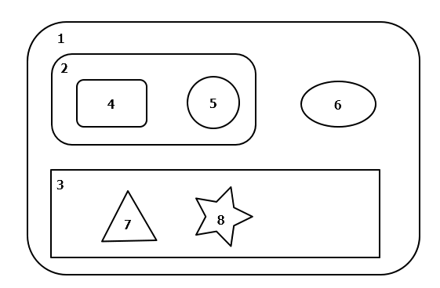
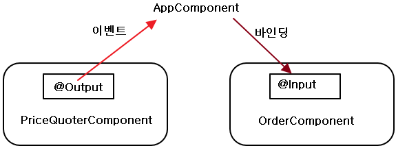
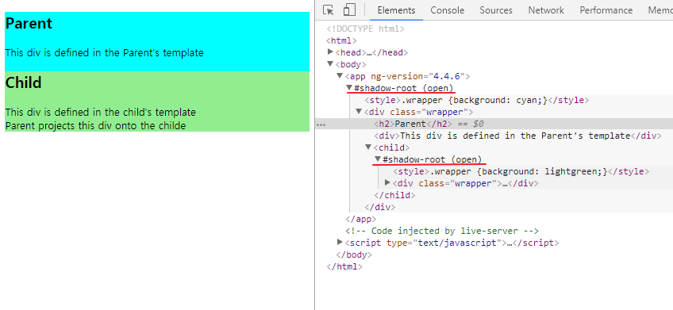
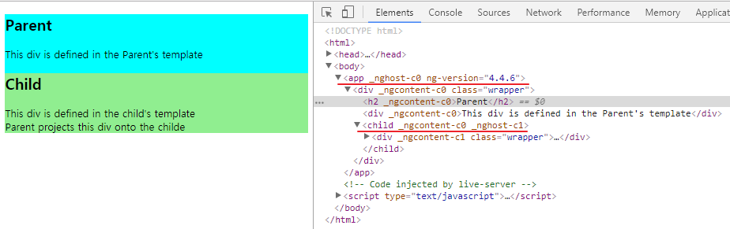
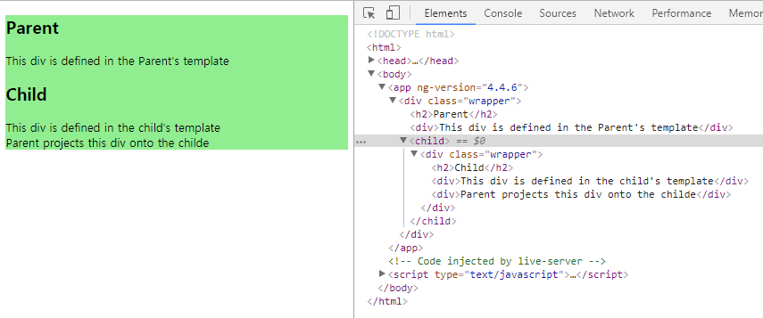
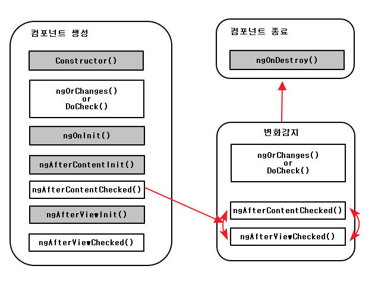
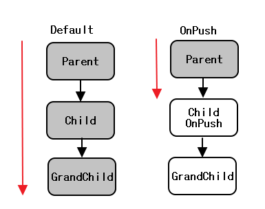
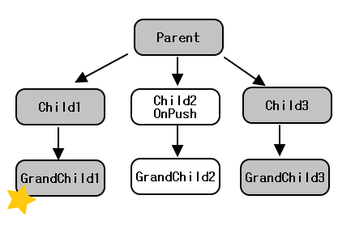

# ch06 컴포넌트 통신  

## 이장에서 다루는 내용  

- 컴포넌트 결합도 낮추기
- 부모-자식 컴포넌트 사이에서 데이터 주고 받기
- 중개자 패턴(Mediator pattern)
- 컴포넌트 생명주기
- Angular 변화 감지기 동작 방식

## Index

- <a href="#6.1">6.1 컴포넌트끼리 통신하기</a>
- <a href="#6.2">6.2 컴포넌트 생명주기</a>
- <a href="#6.3">6.3 변화 감지기 동작 원리</a>
- <a href="#6.4">6.4 자식 컴포넌트의 API 직접 실행하기</a>
- <a href="#6.5">6.5 실습 : 별점 기능 추가하기</a>
- <a href="#6.6">6.6 정리</a>

<div id="6.1"></div>

## 6.1 컴포넌트끼리 통신하기  



- 1컴포넌트는 모든 컴포넌트를 포함
- 2컴포넌트는 컴포넌트4,5포함
- 7,8 컴포넌트는 같은 계층  

### 6.1.1 입력 프로퍼티와 출력 프로퍼티  

- 입력 : 컴포넌트 밖에서 들어오는 데이터는 컴포넌트 프로퍼티에 바인딩할 수 있는데,  
이때 이 데이터를 누가 전해주는 지 컴포넌트가 알 필요는 없으며 어떤 형식의 데이터인지만 필요  
- 출력 : 출력 프로퍼티로 이벤트를 보내는 방법을 사용  


**입력 프로퍼티**  

> app/input_output/input-property-binding.ts  

```
import {platformBrowserDynamic} from "@angular/platform-browser-dynamic";
import {NgModule, Component, Input} from "@angular/core";
import {BrowserModule} from "@angular/platform-browser";

@Component({
  selector: 'order-processor',
  template: `
    Buying {{ quantity }} shares of {{ stockSymbol }}
  `,
  styles: [`:host {
    background: cyan;
  }`]
})
class OrderComponent {
  // 입력 프로퍼티를 2개 선언
  @Input() stockSymbol: string;
  @Input() quantity: number;
}

@Component({
  selector: 'app',
  // AppComponent의 stock 프로퍼티를 OrderComponent의 stockSymbol 프로퍼티로 바인딩
  // OrderComponent의 quantity 변수는 바인딩하지 않고 직접 값을 지정
  template: `
    <input type="text" placeholder="Enter stock (e.g. IBM)"
           (input)="onInputEvent($event)">
    <br/>
    <order-processor [stockSymbol]="stock" quantity="100"></order-processor>
  `
})
class AppComponent {
  stock: string;

  // 사용자가 AppComponent의 입력 필드에 값을 입력하면 부모 컴포넌트의  
  // onInputEvent() 함수가 실행되고, 인자로 받은 이벤트 객체에서 target.value 프로퍼티를 참조해서
  // 클래스 변수 stock에 할당
  onInputEvent({target}): void {
    this.stock = target.value;
  }
}

@NgModule({
  imports: [BrowserModule],
  declarations: [AppComponent, OrderComponent],
  bootstrap: [AppComponent]
})
class AppModule {
}
platformBrowserDynamic().bootstrapModule(AppModule);
```

**입력 프로퍼티의 값이 변경되는 시점 가로채기**  
=> 입력 프로퍼티에 setter를 사용  

> input-property-binding-getter-setter.ts  

```
@Component({
  selector: 'order-processor',
  template: `
    Buying {{ quantity }} shares of {{ stockSymbol }}
  `,
  styles: [`:host {
    background: cyan;
  }`]
})
class OrderComponent {
  private _stockSymbol: string;
  @Input() quantity: number;

  @Input()
  set stockSymbol(value: string) {
    this._stockSymbol = value;
    if (this._stockSymbol !== undefined) {
      console.log(`Sending a Buy order to NASDAQ : ${this._stockSymbol} ${this.quantity}`);
    }
  }

  get stockSymbol(): string {
    return this._stockSymbol;
  }
}
```  

=> 3장에서는 컴포넌트에 데이터를 전달하기 위해 ActivatedRoute를 사용  
=> 위의 경우에는 생성자 함수에 인자로 전달  
=> @input() 어노테이션을 사용하면, 두 컴포넌트가 부모-자식 관계 & 같은 라우터  
안에 있을 때 생성자를 통하지 않고 컴포넌트 프로퍼티를 직접 바인딩 할 수 있음

**출력 프로퍼티와 커스텀 이벤트**  
; 컴포넌트는 EventEmitter 객체를 사용해서 커스텀 이벤트를 발생 시킬 수 있음  
=> 컴포넌트 안 or 부모 계층에서 처리할 수 있음  
=> EventEmitter는 RxJS로 구현된 Subject 클래스의 서브 클래스 & 옵저버블, 옵저버 지원  
=> emit()함수를 사용해 커스텀이벤트를 옵저버블 스트림으로 발생  
subscribe() 함수를 옵저버블 스트림을 구독해서 처리할 수 있음  


> output-property-bindings.ts  

```
import {platformBrowserDynamic} from "@angular/platform-browser-dynamic";
import {NgModule, Component, Output, EventEmitter} from "@angular/core";
import {BrowserModule} from "@angular/platform-browser";

// 주가 정보를 표현할 TypeScript 인터페이스 정의. 일반 객체 대신 인터페이스를 사용하면,
// 인터페이스 형식이 맞지 않는 데이터가 들어왔을 때 에러를 발생시키므로 문제를 쉽게 찾음
interface IPriceQuote {
  stockSymbol: string;
  lastPrice: number;
}

@Component({
  selector: 'price-quoter',
  // 회사이름과 주가를 컴포넌트 UI에 표시. 주가는 CurrentPipe를 사용해서 통화 형식으로 표시
  template: `
    <strong>Inside PriceQuoterComponent : {{ stockSymbol }} {{ price | currency: 'USD' : true : '1.2-2' }}</strong>
  `,
  styles: [`:host {
    background: cyan;
  }`]
})
class PriceQuoterComponent {
  // 출력 프로퍼티로 지정된 lastPrice는 EventEmitter 클래스를 사용하며, 이 프로퍼티에서 보내는 이벤트는
  // 부모 컴포넌트가 받음(이름을 변경하고 싶으면 어노테이션안에 사용 @Output('last-price-event') && 부모 컴포넌트 변경
  @Output() lastPrice: EventEmitter<IPriceQuote> = new EventEmitter<IPriceQuote>();
  // 회사이름은 하드코딩
  stockSymbol: string = 'IBM';
  price: number;

  constructor() {
    // 매초마다 랜덤 값으로 주가를 생성하고, priceQuote 객체에 저장
    setInterval(() => {
      let priceQuote: IPriceQuote = {
        stockSymbol: this.stockSymbol,
        lastPrice: 100 * Math.random()
      };

      this.price = priceQuote.lastPrice;
      // 새로운 값이 생성될 때마다 출력 프로퍼티를 통해 이벤트를 보냄
      this.lastPrice.emit(priceQuote);
    }, 1000);
  }
}

@Component({
  selector: 'app',
  // price-quoter 태그는 PriceQuoterComponent를 의미하며, 이 태그에서 lastPrice 이벤트를 처리하는
  // priceQuoteHandler() 함수는 이벤트 객체에서 주가의 정보를 가져와 화면에 표시
  // lastPrice는 자식 컴포넌트에서 출력 프로퍼티로 지정된 클래스 변수 이름이면서, 부모 컴포넌트에서 사용하는 이벤트 이름
  template: `
    <price-quoter (lastPrice)="priceQuoteHandler($event)"></price-quoter>
    <br>
    <p>App Component received : {{ stockSymbol }} {{ price | currency: 'USD' : true : '1.2-2' }} </p>
  `
})
class AppComponent {
  stockSymbol: string;
  price: number;

  priceQuoteHandler(event: IPriceQuote) {
    this.stockSymbol = event.stockSymbol;
    this.price = event.lastPrice;
  }
}

@NgModule({
  imports: [BrowserModule],
  declarations: [AppComponent, PriceQuoterComponent],
  bootstrap: [AppComponent]
})
class AppModule {
}

platformBrowserDynamic().bootstrapModule(AppModule);
```  

=> AppComponent의 이벤트 핸들러는 IPriceQuote 타입의 이벤트 객체를 인자로 받아  
stockSymbol과 lastPrice의 값을 가져오는데, 이 값들은 컴포넌트 클래스 변수에 할당되어  
템플릿에 표시

### 6.1.2 중개자 패턴  
;각 컴포넌트는 서로 독립적이고 다른 컴포넌트를 최대한 신경쓰지 않는 것이 좋음  
=> 컴포넌트의 결합도를 낮게 유지하면서 서로 데이터를 주고 받으려면,  
중개자 패턴(The Mediator pattern)을 사용하는 것이 좋음  
https://en.wikipedia.org/wiki/Mediator_pattern

  

> Example (app/mediator)  

- stock.ts : 전달하는 데이터의 형식을 정의하는 인터페이스  
  - PriceQuoterComponent에서 이벤트를 보낼때 사용
  - OrderComponent에서 데이터를 받을 때 사용
- price-quoter.component.ts : PriceQuoterComponent를 정의
- order.component.ts : OrderComponent 정의  
- mediator-main.ts : 애플리케이션 실행 코드 작성  

> stock.ts  
```
export interface Stock {
  stockSymbol: string;
  bidPrice: number;
}
```  
=> TS 파일을 브라우저에서 바로 사용하기 위해 SystemJS를 사용  
=> ES5문법에는 인터페이스가 존재하지 않아, stock.ts -> stock.js 변환과정에서  
빈 파일이 생성 됨  
=> SystemJS가 Stock을 ES6 모듈로 인식하기 위해 systemjs.config.js 변경  
```
meta: {
    'app/mediator/stock.ts': {
      format: 'es6'
    }
  },
packages: { ... }
```  

> mediator-main.ts  

```
import {platformBrowserDynamic} from "@angular/platform-browser-dynamic";
import {NgModule, Component} from "@angular/core";
import {BrowserModule} from "@angular/platform-browser";

import {PriceQuoterComponent} from "./price-quoter.component";
import {OrderComponent} from "./order.component";
import {Stock} from './stock';

@Component({
  selector: 'app',
  template: `
    <price-quoter (buy)="priceQuoteHandler($event)"></price-quoter>
    <br/>
    <order-processor [stock]="stock"></order-processor>
  `
})
class AppComponent {
  stock: Stock;

  priceQuoteHandler(event: Stock) {
    this.stock = event;
  }
}

@NgModule({
  imports: [BrowserModule],
  declarations: [
    AppComponent,
    OrderComponent,
    PriceQuoterComponent
  ],
  bootstrap: [AppComponent]
})
class AppModule {
}

platformBrowserDynamic().bootstrapModule(AppModule);
```  

> price-quoter.component.ts  

```
import {Component, Output, Directive, EventEmitter} from "@angular/core";
import {Stock} from './stock';

@Component({
  selector: 'price-quoter',
  template: `
    <strong><input type="button" value="Buy" (click)="buyStocks($event)">
      {{ stockSymbol }} {{ lastPrice | currency: 'USD' : true : '1.2-2' }} </strong>
  `,
  styles: [`:host {
    background: pink;
    padding: 5px 15px 15px 15px;
  }`]
})
export class PriceQuoterComponent {
  @Output() buy: EventEmitter<Stock> = new EventEmitter<Stock>();

  stockSymbol: string = 'IBM';
  lastPrice: number;

  constructor() {
    setInterval(() => {
      this.lastPrice = 100 * Math.random();
    }, 2000);
  }

  buyStocks(): void {
    let stockToBuy: Stock = {
      stockSymbol: this.stockSymbol,
      bidPrice: this.lastPrice
    };

    this.buy.emit(stockToBuy);
  }
}
```

> order.component.ts  
```
import {Component, Input} from "@angular/core";
import {Stock} from './stock';

@Component({
  selector: 'order-processor',
  template: `{{ message }}`,
  styles: [`:host {
    background: cyan;
  }`]
})
export class OrderComponent {
  message: string = 'Waiting for the orders..';

  private _stock: Stock;

  @Input() set stock(value: Stock) {
    if (value && value.bidPrice != undefined) {
      this.message = `Placed order to buy 100 shares of ${value.stockSymbol} at \$${value.bidPrice.toFixed(2)}`;
    }
  }

  get stock(): Stock {
    return this._stock;
  }
}
```

=> 서로 이웃 한 컴포넌트가 부모를 중개자로 사용하는 방법의 예제  
=> 부모가 다르거나, 컴포넌트들이 한 화면에 표시 되는 상황이 아니면 ?  
=> 서비스를 중개자로 사용  


### 6.1.3 프로젝션  
; Angular는 부모 컴포넌트 템플릿의 일부분을 자식 컴포넌트 템플릿에 넣을 수 있는  
기능을 제공하며, ngContent 디렉티브를 사용  
(트랜스클루전(transclusion)=>프로젝션(projection)으로 용어 변경)  
=> 부모 컴포넌트에서 템플릿을 정의하지만, 자식 컴포넌트에서 렌더링 됨  

1. 자식 컴포넌트 템플릿에 ```<ng-content>``` 태그를 추가해 부모 컴포넌트가 보내는  
템플릿이 위치할 곳을 지정. 라우터를 사용할 때 ```<router-outlet>```을 사용하는 것과 비슷  

2. 부모 컴포넌트에서 자식 컴포넌트 태그 안쪽에 원하는 내용을 넣음  
자식 컴포넌트를 표현하는 태그가 ```<my-child>```라면 태그 안쪽에있는 내용이 전달  
```
template : `
  ...
  <my-child>
    <div> Passing this div to the childe </div>
  </my-child>
  ...
`
```  

> Example  app/projection  

> basic-ng-content.ts  

```
import {platformBrowserDynamic} from "@angular/platform-browser-dynamic";
import {NgModule, Component, ViewEncapsulation} from "@angular/core";
import {BrowserModule} from "@angular/platform-browser";

@Component({
  selector: 'child',
  styles: ['.wrapper {background: lightgreen;}'],
  // 부모 컴포넌트에서 전달하는 템플릿은 <ng-content>에 표시
  template: `
    <div class="wrapper">
      <h2>Child</h2>
      <div>This div is defined in the child's template</div>
      <ng-content></ng-content>
    </div>
  `,
  encapsulation: ViewEncapsulation.Native
})
class ChildComponent {
}

@Component({
  selector: 'app',
  styles: ['.wrapper {background: cyan;}'],
  // <child> 태그 안 내용은 AppComponent에서 렌더링하지 않고, ChildComponent로 전달
  template: `
    <div class="wrapper">
      <h2>Parent</h2>
      <div>This div is defined in the Parent's template</div>
      <child>
        <div>Parent projects this div onto the childe</div>
      </child>
    </div>
  `,
  encapsulation: ViewEncapsulation.Native
})
class AppComponent {
}

@NgModule({
  imports: [BrowserModule],
  declarations: [AppComponent, ChildComponent],
  bootstrap: [AppComponent]
})
class AppModule {
}

platformBrowserDynamic().bootstrapModule(AppModule);
```  

  

=> AppComponent와 ChildComponent는 각각 Shadow DOM을 만들고, AppComponent에서  
전달하는 템플릿은 ChildComponent 안에 렌더링 됨  
=> #shadow-root는 부모 컴포넌트와 분리된 DOM을 생성하기 때문에  
각 wrapper 클래스의 스타일이 다르게 적용 됨  

> ViewEncapsulation.Emulated로 실행  

  

=> #shadow-root가 사용되지 않고, 캡슐화를 구현하기 위해 DOM 객체에 어트리뷰트를  
추가로 생성하지만, 화면은 여전히 같은 모습으로 렌더링  

> ViewEncapsulation.None으로 실행

  

=> 부모 컴포넌트와 자식 컴포넌트가 일반 DOM 노드로 구성되어 있고, 스타일도  
캡슐화 되지 않아 자식 컴포넌트에서 지정한 .wrapper 스타일은 부모의 스타일에 가려짐  

**여러 구역에 프로젝션 하기**  
; header(부모), contents(자식), footer(자식)로 나뉘어 진 경우  
=> select 어트리뷰트로 구별 가능

```
<ng-content select=".header"></ng-content>
<div> This content is defined in child </div>
<ng-content select=".footer"></ng-content>
```  

> Eg) app/projection/ng-content-selector.ts  

```
import {platformBrowserDynamic} from "@angular/platform-browser-dynamic";
import {NgModule, Component} from "@angular/core";
import {BrowserModule} from "@angular/platform-browser";

@Component({
  selector: 'child',
  styles: ['.child {background: lightgreen;}'],
  template: `
    <div class="child">
      <h2>Child</h2>
      <ng-content select=".header"></ng-content>
      <div>This content is defined in child</div>
      <ng-content select=".footer"></ng-content>
    </div>
  `
})
class ChildComponent {
}

@Component({
  selector: 'app',
  styles: ['.app {background: cyan;}'],
  template: `
    <div class="app">
      <h2>Parent</h2>
      <div>This div is defined in the Parent's template</div>
      <child>
        <div class="header">Child got this header from parent {{ todaysDate }}</div>
        <div class="footer">Child got this footer from parent</div>
      </child>
    </div>
  `
})
class AppComponent {
  todaysDate: string = new Date().toLocaleDateString();
}

@NgModule({
  imports: [BrowserModule],
  declarations: [AppComponent, ChildComponent],
  bootstrap: [AppComponent]
})
class AppModule {
}

platformBrowserDynamic().bootstrapModule(AppModule);
```

**note:innerHTML로 직접바인딩하기**  
```
<p [innerHTML]="myComponentProperty"></p>
```  

innerHTML보다 ngContent를 사용하는 이유?
- innerHTML은 브라우저에 따라 동작하지 않을 수 있음(ngContent는 Angular에서 제공하는 기능)  
- ngContent를 사용하면 여러 구역에 나뉘어 전달된 HTML을 한 번에 지정할 수 있음  
- ngContent를 사용하면 부모 컴포넌트의 프로퍼티를 HTML에 실어 전달할 수 있음

---

<div id="6.2"></div>

## 6.2 컴포넌트 생명주기  
-> 컴포넌트가 생성되면 Angular 변화 감지기가 컴포넌트를 모니터링  
-> 컴포넌트 초기화 -> DOM에 추가 -> 사용자가 볼 수 있게 렌더링  
-> 컴포넌트의 상태나 내부의 프로퍼티 값이 변경되면 UI를 다시 렌더링  

> 컴포넌트 생명 주기  

- 진한 회색 : 한번만 실행 / 그 외 : 여러번 실행

  

=> 컴포넌트의 초기화 이후 화면에서 컴포넌트 볼 수 있음  
=> 컴포넌트의 프로퍼티 값과 화면의 값이 변화 감지기에 의해 동기화된 상태로 유지  
=> 라우터에서 화면을 전환하거나 ngIf와 같은 구조 디렉티브에 의해 컴포넌트가  
DOM 트리에서 제거되면 컴포넌트가 종료  

- ngOnChanges() : 부모 컴포넌트에서 자식 컴포넌트의 입력 프로퍼티로 바인딩 된 값이  
변경되거나 프로퍼티 값이 초기화 될 때 실행되고, 컴포넌트에 입력 프로퍼티가 없으면 실행 X  
- ngOnInit() : 프로퍼티 값을 초기화하려고 ngOnChanges()가 처음 실행된 뒤에 실행된다.  
컴포넌트 생성자 함수에서 변수들을 초기화한다고 해도, 생성자 함수가 실행되는 시점에는  
컴포넌트 프로퍼티들이 아직 생성되지 않지만, ngOnInit()이 실행되는 시점은 컴포넌트  
프로퍼티들이 생성되어 초기화되고 난 이후  
- ngAfterContentInit() : ngContent 디렉티브를 사용해서 자식 컴포넌트에 HTML 조각을 전달하면  
자식 컴포넌트가 초기화 된 이후에 실행된다.  
- ngAfterContentChecked() : ngContent 디렉티브를 통해 부모 컴포넌트에서 HTML 조각을 받은  
직후에 자식 컴포넌트 쪽에서 실행된다. ngContent에 바인딩된 항목이 있으면 이 항목의 값이  
변경 된 경우에도 실행된다.  
- ngAfterViewInit() : 컴포넌트 템플릿의 바인딩이 완료된 후에 실행된다. 부모 컴포넌트가  
먼저 초기화되고 그 다음 자식 컴포넌트가 초기화 되기 때문에, 이 함수는 자식 컴포넌트 들이  
모두 준비된 후에 실행된다.  
- ngAfterViewChecked() : 컴포넌트 템플릿에 바인딩 된 항목의 값이 변경되면 실행된다.  
이 함수는 컴포넌트 내부나 외부에서 발생 한 변경 사항을 반영하기 위해 여러번 호출 될 수 있다.  

=> 생명주기 콜백 함수 일므에 Content가 들어간 항목은 ```<ng-content>``` 디렉티브를 사용하는 경우에만  
실행되며, 함수 이름에 View가 들어간 항목은 컴포넌트 템플릿과 관련된 것.  
Checked는 컴포넌트와 DOM 이 동기화된 직후를 뜻함  

=> 생명주기 함수들은 ng라는 접두사를 생략한 함수명과 같은 이름의 인터페이스로 정의  
e.g : ngOnChanges() 콜백함수를 사용하려면 implements OnChanges 를 추가

[ref : 생명주기 가로채기](https://angular.io/guide/lifecycle-hooks)  

### 6.2.1 ngOnChanges() 함수 사용하기  

e.g : 부모-자식 컴포넌트로 구성되고, 자식 컴포넌트에는 greeting과 user의 입력 프로퍼티  
존재 (greeting은 문자열, user는 name 프로퍼티가 있는 객체 타입)  


**뮤터블vs이뮤터블**  

```
var greeting = 'Hello';
greeting = 'Hello Mary';
```  

=> "Hello" 문자열 생성 & "Heelo Mary" 문자열 생성 + greeting 참조 값 변경  
=> 두 문자열 모두 메모리에 있고 각각은 이뮤터블  

```
var user = {name : 'John'};
user.name='Mary';
```  
=> 메모리에 객체 생성 + user변수는 객체를 참조 & 'John'문자열 메모리에 생성 + user.name이 참조  
=> user.name은 새로운 문자열 'Mary'를 참조 BUT user는 같은 객체를 참조  

> app/comp_lifecycle/on-changes-with-param.ts  

```
import {platformBrowserDynamic} from "@angular/platform-browser-dynamic";
import {NgModule, Component, Input, OnChanges, SimpleChange, enableProdMode} from "@angular/core";

import {BrowserModule} from "@angular/platform-browser";
import {FormsModule} from "@angular/forms";

// 값을 저장 할 객체의 형식을 정의. 이 인터페이스는 ngOnChanges() 에서 사용하고
// 객체의 키는 문자열 타입을 사용하며, 값의 변화를 확인하기 위해 Angular에서 제공하는 SimpleChange 클래스를 사용
interface IChanges {
  [key: string]: SimpleChange
};

@Component({
  selector: 'child',
  styles: ['.child {background: lightgreen;}'],
  template: `
    <div class="child">
      <h2>Child</h2>
      <div>Greeting : {{greeting}}</div>
      <div>User name : {{user.name}}</div>
      <div>Message : <input [(ngModel)]="message"></div>
    </div>
  `
})
class ChildComponent implements OnChanges {
  // AppComponent에서 데이터를 받기 위해 입력 프로퍼티 지정
  @Input() greeting: string;
  @Input() user: { name: string };
  // @Input 어노테이션 지정X => 값이 변경되어 ngOnChanges() 함수는 실행X
  message: string = 'Initial message';

  // 입력 프로퍼티의 값이 변경되면 사용
  ngOnChanges(changes: IChanges) {
    console.log(JSON.stringify(changes, null, 2));
  }
}

@Component({
  selector: 'app',
  styles: ['.parent{background: lightblue;}'],
  template: `
    <div class="parent">
      <h2>Parent</h2>
      <div>Greeting : <input type="text" [value]="greeting" (input)="greeting=$event.target.value"></div>
      <div>User name : <input type="text" [value]="user.name" (input)="user.name=$event.target.value"></div>
      <child [greeting]="greeting" [user]="user"></child>
    </div>
  `
})
class AppComponent {
  greeting: string = "Hello";
  user: { name: string } = {name: 'John'};
}

// Angular 운영모드 활성화
enableProdMode();

@NgModule({
  imports: [BrowserModule, FormsModule],
  declarations: [AppComponent, ChildComponent],
  bootstrap: [AppComponent]
})
class AppModule {
}

platformBrowserDynamic().bootstrapModule(AppModule);
```  

=> 입력 프로퍼티로 바인딩 된 값이 변경되면 ngOnChanges() 함수가 실행 + SimpleChange 객체 전달  
1) greeting 필드 값 변경 => Angular의 변화 감지기가 동작해서 자식 컴포넌트의 이뮤터블 입력 프로퍼티를  
갱싢다고 ngChanges() 콜백 함수를 실행시키며 변경되기 전 값과 변경 된 값이 콘솔에 출력  
2) User name 필드 값 변경 => 뮤터블 객체인 user안에 있는 name 프로퍼티가 변경된 것이지 자식 컴포넌트  
에 바인딩 된 user 객체가 변경된 것은 아니기 때문에 ngOnChanges()는 실행X  
3) message 필드 값 변경 => @input 어노테이션으로 지정하지 않아서 ngOnChanges() 실행X  

---

<div id="6.3"></div>  

## 6.3 변화 감지기 동작 원리  
; Angular 변화 감지기는 Zone(zone.js) 라이브러리를 사용해서 구현되었으며, 컴포넌트 프로퍼티의 값과  
UI의 상태를 동기화하기 위해 만들어짐  

**변화감지정책**  
- Default : 컴포넌트 트리 전체를 돌면서 컴포넌트가 변경되었는지 검사  
- OnPush : 자식 컴포넌트부터 그 아래 계층은 컴포넌트가 변경되었는 지 검사X  
``` changeDetection : ChangeDetectionStrategy.OnPush```  

  

- Default : 변화감지기는 최상위 부모 컴포넌트부터 시작해 모든 자손을 검사  
- OnPush : 자식 컴포넌트에 바인딩된 프로퍼티가 변경되지 않는 한, 변화 감지기는  
부모 컴포넌트에서 멈춘다.  

  

=> GrandChild1 컴포넌트에서 이벤트 발생  
=> 최상위 컴포넌트(Parent)부터 시작해서 OnPush 정책이 아닌 모든 컴포넌트를 순회(회색으로 표시 된 컴포넌트)    
=> Child2, GrandChild2는 Child2 컴포넌트에 바인딩된 입력 프로퍼티 값이 바뀌지 않는 이상 변화 감지기의 대상에서  
제외  

[ref : Angular 변화 감지 방식](http://mng.bz/bD6v)  

---

<div id="6.4"></div>

## 6.4 자식 컴포넌트의 API 직접 실행하기

> Example  

자식 컴포넌트에 greeting() 함수가 있고 부모 컴포넌트에서 이 함수를 실행  
(2가지 방법을 살펴보기 위해 자식 컴포넌트는 두 개의 인스턴스로 만들고 각 인스턴스에  
템플릿 변수를 지정)

```
<child #child1></child>
<child #child2></child>
```  

```
// @ViewChild는 자식 컴포넌트를 가리키기 위해 사용  
@ViewChild('child1')
firstChild : ChildComponent;
...
this.firstChild.greeting('Child 1');
// 자식 컴포넌트 중에 child1이라는 템플릿 변수를 갖는 컴포넌트를 찾아 firstChild라는 변수에 할당  
// 자식 컴포넌트의 함수를 직접 실행  
```  

```
<button (click)="child2.greet('Child2')">자식2에서 greeting() 실행</button>
// 컴포넌트 코드를 사용하지 않고, 부모 컴포넌트의 템플릿에서 접근하는 방법  
```  

> app/child_api/exposing-child-api.ts  

```
import {platformBrowserDynamic} from "@angular/platform-browser-dynamic";
import {NgModule, Component, ViewChild, AfterViewInit} from "@angular/core";
import {BrowserModule} from "@angular/platform-browser";

@Component({
  selector: 'child',
  template: `<h3>Child</h3>`
})
class ChildComponent {
  greet(name) {
    console.log(`Hello from ${name}.`);
  }
}

@Component({
  selector: 'app',
  template: `
    <h1>Parent</h1>
    <child #child1></child>
    <child #child2></child>
    <button (click)="child2.greet('Child2')">Invoke get() on child 2</button>
  `
})
class AppComponent implements AfterViewInit {
  @ViewChild('child1')
  firstChild: ChildComponent;

  ngAfterViewInit() {
    this.firstChild.greet('Child1');
  }
}

@NgModule({
  imports: [BrowserModule],
  declarations: [AppComponent, ChildComponent],
  bootstrap: [AppComponent]
})
class AppModule {
}

platformBrowserDynamic().bootstrapModule(AppModule);
```  

**생명주기를 가로채는 함수에서 UI 갱신하기**  
; 자식 컴포넌트의 greet() 함수에서 ngAfterInit()함수가 실행되기 전에 화면을 변경하면  
에러 발생 => 부모 컴포넌트의 ngAfterViewInit() 함수와 자식의 ngAfterViewInit()함수는  
같은 이벤트 루프 안에서 실행되는데, ngAfterInit()함수가 끝난 이후에야 화면이 렌더링 되므로  

1) Angular가 바인딩 검사를 추가로 하지 않는 운영모드에서 애플리케이션 실행  
2) setTimeout() 함수를 사용해서 다음 이벤트 루프에서 화면을 갱신  

---  

<div id="6.5"></div>

## 6.5 실습 : 별점 기능 추가하기  

> tsconfig.json  

```
{
  "compilerOptions": {
    "experimentalDecorators": true,
    "module": "commonjs",
    "target": "es2015",
    "noEmit": true
  }
}
```

### 6.5.1 StartsComponent 클래스 수정하기  
; ProductService에서 받은 별점을 표시하기만 하는 모드와 새로운 별점을 매길 수 있는 모드를 구분  

> stars.component.ts  

```
import {Component, EventEmitter, Input, Output} from '@angular/core';

@Component({
  selector: 'auction-stars',
  styles: [' .starrating { color: #d17581; }'],
  templateUrl: 'app/components/stars/stars.component.html'
})
export default class StarsComponent {
  private _rating: number;
  private stars: boolean[];

  private maxStarts: number = 5;

  // Leave a Review 버튼 클릭 시 false로 변경
  @Input()
  readonly: boolean = true;

  @Input()
  get rating(): number {
    return this._rating;
  }

  // 서비스에서 받은 데이터로 별점을 렌더링할 때 실행되거나  
  // 사용자가 별점을 클릭했을 때 부모 컴포넌트에서 실행
  set rating(value: number) {
    this._rating = value || 0;
    this.stars = Array(this.maxStarts).fill(true, 0, this.rating);
  }

  // 별점이 변경되면 이벤트를 부모 컴포넌트로 보냄
  @Output()
  ratingChange: EventEmitter<number> = new EventEmitter<number>();

  fillStarsWithColor(index) {
    if (!this.readonly) {
      if (this.rating > index) {
        this.rating = index;
      } else {
        this.rating = index + 1;
      }      
      this.ratingChange.emit(this.rating);
    }
  }
}
```

### 6.5.2. StatsComponent 템플릿 수정하기  

> starts.component.html  

```
<p>
  <!-- 별점 클릭 시 fillStarsWithColor(i) 실행 -->
  <span *ngFor="let star of stars; let i = index"
        class="starrating glyphicon glyphicon-star"
        [class.glyphicon-star-empty]="!star"
        (click)="fillStarsWithColor(i)">
  </span>
  <span>{{rating | number:'.0-2'}} stars</span>
</p>
```  

### 6.5.3 ProductDetailComponent 템플릿 수정하기  

> product-detail.component.html  

```
<div class="thumbnail">
  
  <div>
    <h4 class="pull-right">{{ product.price }}</h4>
    <h4>{{ product.title }}</h4>
    <p>{{ product.description }}</p>
  </div>
  <div class="ratings">
    <p class="pull-right">{{ reviews.length }} reviews</p>
    <p>
      <auction-stars [rating]="product.rating"></auction-stars>
    </p>
  </div>
</div>
<div class="well" id="reviews-anchor">
  <div class="row">
    <div class="col-md-12"></div>
  </div>
  <div class="text-right">
    <!-- 리뷰 등록 버튼 -->
    <button (click)="isReviewHidden=!isReviewHidden" class="btn btn-success btn-green">Leave a Review</button>
  </div>
  <!--
    리뷰 등록 div
    [(rating)], [(ngModel)]은 양방향 데이터 바인딩
  -->  
  <div [hidden]="isReviewHidden">
    <div>
      <auction-stars [(rating)]="newRating" [readonly]="false" class="large"></auction-stars>
    </div>
    <div>
      <textarea [(ngModel)]="newComment"></textarea>
    </div>
    <div>
      <button (click)="addReview()" class="btn">Add review</button>
    </div>
  </div>

  <div class="row" *ngFor="let review of reviews">
    <hr>
    <div class="col-md-12">
      <auction-stars [rating]="review.rating"></auction-stars>
      <span>{{ review.user }}</span>
      <span class="pull-right">{{ review.timestamp | date : 'shortDate' }}</span>
      <p>{{ review.comment }}</p>
    </div>
  </div>
</div>
```  

### 6.5.4 ProductDetailComponent 클래스 코드 수정하기  

> product-detail.component.ts  

```
import {Component} from '@angular/core';
import {ActivatedRoute} from '@angular/router';
import {Product, Review, ProductService} from '../../services/product.service';

@Component({
  selector: 'auction-product-page',
  templateUrl: 'app/components/product-detail/product-detail.component.html'
})
export default class ProductDetailComponent {
  product: Product;
  reviews: Review[];

  newComment: string;
  newRating: number;

  isReviewHidden: boolean = true;


  constructor(route: ActivatedRoute, productService: ProductService) {
    let prodId: number = parseInt(route.snapshot.params['productId']);
    this.product = productService.getProductById(prodId);
    this.reviews = productService.getReviewsForProduct(this.product.id);
  }

  addReview() {
    let review = new Review(0, this.product.id, new Date(), 'Anonymous', this.newRating, this.newComment);
    console.log('Adding review' + JSON.stringify(review));

    // 전개 연산자
    this.reviews = [...this.reviews, review];
    this.product.rating = this.averageRating(this.reviews);

    this.resetForm();
  }

  averageRating(reviews: Review[]) {
    let sum = reviews.reduce((average, review) => average + review.rating, 0);
    return sum / reviews.length;
  }

  resetForm() {
    this.newRating = 0;
    this.newComment = null;
    this.isReviewHidden = true;
  }
}
```  

### 6.5.5 AppModule 수정하기  
; FormsModule 추가  

> app.module.ts  

```
...
import {FormsModule, ReactiveFormsModule} from '@angular/forms';
...

@NgModule({
  imports: [BrowserModule, FormsModule, ReactiveFormsModule,
  ...
```


---

<div id="6.6"></div>

## 6.6 정리

- 부모 컴포넌트와 자식 컴포넌트는 직접 연결하는 것을 피하고 입력 프로퍼티와 출력 프로퍼티로  
데이터를 주고 받아야 한다.
- 컴포넌트는 출력 프로퍼티를 통해 이벤트를 발생시킬 수 있고, 이벤트를 받는 컴포넌트는  
전달된 이벤트 객체에 담긴 정보를 활용할 수 있다.  
- 부모 자식 관계가 아닌 컴포넌트끼리는 중개자 디자인 패턴을 사용해서 데이터를 주고 받을 수 있다.
- 부모 컴포넌트는 자식 컴포넌트가 실행되는 시점에 템플릿 조각을 전달할 수 있다.
- 컴포넌트의 생명주기를 가로채서 원하는 동작을 할 수 있다.
- 컴포넌트 변화 감지 정책을 OnPush로 지정하면, 변화 감지기의 대상에서 이 컴포넌트를 제외할 수 있다.


<br /><br /><br /><br /><br /><br /><br /><br /><br /><br /><br /><br /><br /><br /><br /><br />

---
