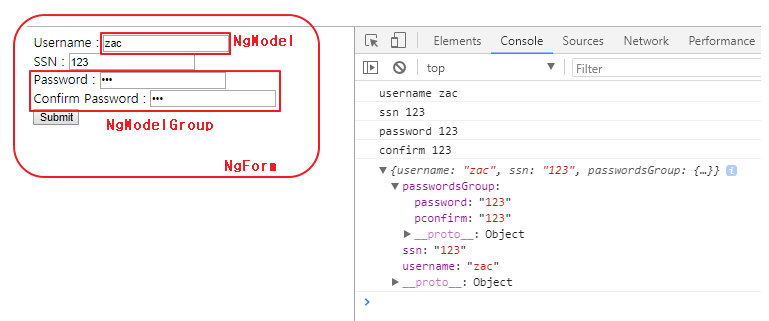

# ch07. 폼 처리하기

#### 7장에서 다루는 내용  
- Angular 폼 구성 요소
- 템플릿 기반 폼 처리하기
- 반응형 폼 처리하기
- 폼 유효성 검증  

**템플릿 기반 폼 vs 반응형 폼**  
- 템플릿 기반 폼 : 컴포넌트 템플릿을 최대한 활용해서 폼을 구성  
폼 구조, 각 필드의 형식, 유효성 검증 규칙을 모두 템플릿에서 정의  
- 반응형 폼 : TypeScript 코드에 있는 폼 모델 기준, 미리 준비된  
템플릿에 바인딩하거나 템플릿을 동적으로 구성하는 방식  

#### index  

- <a href="#7.1">7.1 HTML 폼</a>
- <a href="#7.2">7.2 템플릿 기반 폼</a>
- <a href="#7.3">7.3 반응형 폼</a>
- <a href="#7.4">7.4 폼 유효성 검사</a>
- <a href="#7.5">7.5 실습 : 검색 폼에 유효성 검사 추가하기  </a>
- <a href="#7.6"></a>

---  

<div id="7.1"></div>  

## 7.1 HTML 폼  
HTML에서도 폼 구성, 유효성 검증하며 데이터를 서버로 전송가능  
BUT 원하는 로직으로 검증하고, 사용자가 알아보기 쉽게 에러를 표시한다든지  
원하는 형식으로 파싱 등 HTML 표준 폼만으로는 충분하지 않음  
(웹 APP에 사용 할 프레임워크를 선택할 때 폼을 얼마나 자유롭게 다룰 수 있는가도 중요한  
기준이 될 수 있음)  

### 7.1.1 HTML 표준 폼  

> 표준 HTML으로 만든 회원 가입 폼  

```
<form action="register" method="POST">
  <div>Username : <input type="text"></div>
  <div>SSN : <input type="text"></div>
  <div>Password : <input type="password"></div>
  <div>Confirm password : <input type="password"></div>
  <button type="submit">Submit</button>
</form>
```

=> HTML 표준 폼은 아래와 같은 점에서 SPA에 적합하지 않음  
- 각 입력 필드에 유효성 검증 로직이 적용되어야 한다
- 에러 메시지는 문제가 발생한 입력 필드 근처에 표시되는 것이 좋다  
- 연관된 항목은 유효성 검사를 할 때도 같이 검사해야 한다. 이 폼에는 비밀번호를  
받는 필드와 비밀번호를 확인하는 필드가 연관되어 있기 때문에, 어느 한 필드의 값이 변경되면  
다른 필드도 다시 검사해야 한다.  
- 데이터를 서버로 보낼 때 APP에서 이 과정을 조작할 수 있어야 한다
- 데이터를 서버로 보낼 때 일반적인 HTTP 요청이나 AJAX 요청으로 보낼지, WebSocket을  
사용할지 결정할 수 있어야 한다.  

**HTML 유효성 검증 어트리뷰트**  
입력 필드에 required, pattern, maxlength, min, max, step과 같은 표준 어트리뷰트를 사용해서  
유효성을 검증할 수 있음  

```
<input id="username" type="text" required pattern="[a-zA-Z0-9]+">  
```  

=> Chrome 등 브라우저에서 규칙에 맞지 않는 입력 데이터가 입력되면 에러메시지(요청한 형식과 일치시키세요)  
가 표시하지만, 아래와 같은 UX 단점이 존재

- 메시지의 의미가 모호하며 문제를 해결할 수 있는 명확한 정보를 제공하지 않음
- 입력 필드에서 다른 곳으로 포커스를 옮기면 에러 메시지도 사라짐
- 메시지 팝업이 APP 스타일과 어울리지 않음  

**입력 필드 타입 지정하기**  
; 입력 필드에 text, number, url, email과 같은 타입을 지정하면, 지접한 타입 이외의 값이 입력되는 것을 막음  

```
<input id="zipcode" type="number" min="10000" max="99999">
```  

=> 숫자로 이루어진 우편번호 5자리를 제한하기 위해 사용  
BUT 5자리의 숫자가 모두 우편번호인 것X + 사용자가 입력한 주소에 맞는 우편번호만 유효  

### 7.1.2 Angular 폼  

- 템플릿 기반 폼 : 템플릿에서 디렉티브를 사용하여 컴포넌트 템플릿에 폼 모델을 정의  
(HTML 문법만으로는 다양한 폼을 구성하는 데에 한계가 있어, 템플릿 기반의 폼은 단순한 경우에만 사용)
- 반응형 폼 : 클래스 코드에서 폼 컨트롤을 사용. TypeScript코드에서 폼 데이터 구조를 정의하며  
폼 모델을 만들고 난 후에는 form* 접두사가 붙은 디렉티브를 사용해서 HTML 템플릿에 모델을 연결  

=> 두 방식의 중요개념 + 차이  

- 두 방식 모두 폼 데이터를 저장하는 데이터 구조(model)가 있음  
템플릿 기반 폼에서는 디렉티브를 사용해서 템플릿에 모델을 정의  
반응형 폼에서는 TypeScript 코드로 모델을 정의하고, HTML 템플릿에 각 항목 연결  
- 반응형 폼에서는 @angular/forms 모듈의 FormControl, FormGroup, FormArray를 사용하는 클래스 객체여야 함
- 반응형 폼으로 폼을 구성하더라도, 화면을 구성하는 HTML 템플릿은 여전히 필요. 폼 컨트롤이  
연결될 HTML 엘리먼트는 템플릿에서 정의해야 함  

**폼 API 활성화 하기**  
; NgModule 어노테이션의 imports 항목에 템플릿 기반 폼(FormsModule), 반응형 폼(ReactiveFormsModule) 추가

```
```  

---  

<div id="7.2"></div>  

## 7.2 템플릿 기반 폼  
; 디렉티브만 사용가능하고, FormsModule에 있는 NgModel, NgModelGroup, NgForm 이용  

=> 5장의 양방향 데이터 바인딩을 구현할 때 NgModel 디렉티브 이용  
=> 폼에서는 이 디렉티브가 다른 역할(HTML 엘리먼트를 지정해서 폼 모델을 구성하는 용도)로 사용  


### 7.2.1 템플릿 기반 폼에 사용하는 디렉티브  

**NgForm**  
; 폼 전체를 가리키는 디렉티브이며, 폼 모듈을 로드하면 모든 ```<form>``` 엘리먼트에  
이 디렉티브가 자동으로 적용  
=> 기존에 동작하던 ```<form>``` 엘리먼트가 동작하지 않을 수 있으니 주의  
=> NgForm 디렉티브는 자식 HTML 엘리먼트를 순회하며 NgModel 디렉티브가 있는 항목을 찾고  
이 엘리먼트를 폼 모델에 추가  

```
<div ngForm></div> // 어트리뷰트로 적용
<ngForm></ngForm> // 엘리먼트로 적용
```  
=> 사용하는 CSS 프레임워크에서 정해진 구조의 HTML을 요구하거나 form 엘리먼트를 사용할 수  
없는 경우, 기존 화면 구성을 건드리지 않고 NgForm을 적용해야 하는 경우에 위와 같은 방식 사용 가능  

```
<form ngNoForm></form>
```  
=> form엘리먼트를 사용하지만, Angular로 제어하지 싶지 않을 경우  
=> ngNoForm 어트리뷰트를 사용하면 해당 폼에 NgForm 인스턴스가 생성되지 않으며 일반 HTML로 동작  

```
<form #f="ngForm"></form>
<pre>{{ f.value | json }}</pre>
```  
=> @Directive 어노테이션 안에 exportAs 프로퍼티가 선언되어 있어 NgForm 인스턴스에서 값을 참조할 때  
지역 템플릿 변수를 지정해서 사용할 수 있음  
=> NgForm 인스턴스의 f 변수가 ngForm이라는 이름을 사용하도록 ```<form>``` 엘리먼트에 exportAs 프로퍼티  
(위의 #로 사용)를 지정하면, f 변수를 통해 NgForm 인스턴스의 프로퍼티에 접근 가능  
=> 폼의 모든 값을 JS 객체 타입으로 확인하려면, NgForm 인스턴스의 value 프로퍼티를 사용할 수 있으며  
json 파이프를 사용해서 화면에 표시할 수도 있음  

```
<form #f="ngForm" (ngSubmit)="onSubmit(f.value)"></form>
```  
=> NgForm을 사용하면 폼에서 발생하는 submit 이벤트를 가로채서 서버로 데이터를 보내는 동작을 막음  
=> 위 코드는 이벤트 바인딩 문법으로 ngSubmit 이벤트를 onSubmit() 함수에 연결하며, ngSubmit 이벤트가  
발생해서 onSubmit() 함수가 실행될 때 NgForm에서 선언한 템플릿 변수 f의 value 프로퍼티를 인자로 전달  

**NgModel**  
; 템플릿 기반 폼에서 NgModel은 폼에 있는 필드 하나를 가리키며, 이 디렉티브를 사용하면 필드에 FormControl  
인스턴스가 생성되고, 이 인스턴스에 필드의 값을 저장  

```
<form>
  <input type="text"
    // ngModel을 HTML 엘리먼트에 사용할 때는 name 어트리뷰트를 지정
    name="username"
    // 데이터 바인딩 문법이 아니므로 할당하는 값이나 괄호가 없음
    // NgForm 디렉티브를 위한 것
    ngModel>
</form>
```  
=> NgForm.value 프로퍼티는 폼에 있는 모든 값을 저장하고 있는 JS 객체이며  
위 코드에서 name 어트리뷰트로 지정 된 input 필드의 값은 JS 객체인 NgForm.value에  
name 프로퍼티로 저장  

```
<form>
  <input type="text"    
    name="username"
    ngModel    
    // NgModel의 exportAs 프로퍼티는 ngModel을 가리킴.
    // 이 코드에서는 템플릿 변수 c로 선언
    #c="ngModel">
    // 템플릿 변수 c로 지정한 input 엘리먼트의 값을 참조하기 위해
    // NgModel 인스턴스의 value 프로퍼티를 사용
  <pre>{{c.value}}</pre>
</form>
```  

**NgModelGroup**  
; 폼 필드를 그룹으로 묶어 사용할 수 있음. NgForm과 유사하게 NgModelGroup도 FormGroup 인스턴스를  
내부적으로 생성  
=> 기본적으로 NgModelGroup을 사용하면 NgForm.value 객체 안에 또 다른 객체를 만들고 값을 저장하는데,  
NgModelGroup에 속한 모든 필드는 이 객체의 프로퍼티가 됨  

```
<form #f="ngForm">
  // ngModelGroup 어트리뷰트에 중첩된 형태로 만들 객체의 이름을 지정
  <div ngModelGroup="fullName">
    <input type="text" name="firstName" ngModel>
    <input type="text" name="lastName" ngModel>
  </div>
</form>

// NgModelGroup에서 만든 fullName 객체를 참조
<pre>First name : {{ f.value.fullName.firstName }}</pre>
<pre>Last name : {{ f.value.fullName.lastName }}</pre>
```  

### 7.2.2 HTML 폼에 적용하기  

> 01_template_driven.ts 부분

```
<form #f="ngForm" (ngSubmit) = "onSubmit(f.value)">
...
</form>
```  

=> ```<form>``` 엘리먼트에 적용되는 NgForm 객체를 가리키기 위해 템플릿 변수 f선언  
=> 위 변수로 value나 valid와 같은 폼 프로퍼티에 접근할 수 있고, 폼에서 에러가 발생하면  
어떤 종류의 에러가 발생했는지도 확인할 수 있음  

```
<div>Username : <input type="text" name="username" ngModel></div>
<div>SSN : <input type="text" name="ssn" ngModel></div>
```  
=> ngModel 어트리뷰트를 사용해서 ```<input>``` 엘리먼트에 NgModel 디렉티브를 적용  
=> ngModel 어트리뷰트를 적용하는 엘리먼트에는 name 어트리뷰트도 함께 사용해야 한다  

```
<div ngModelGroup="passwordsGroup">
  <div>Password : <input type="password" name="password" ngModel></div>
  <div>Confirm Password : <input type="password" name="pconfirm" ngModel></div>
</div>
```  
=> ngModelGroup 디렉티브를 사용하면 NgForm 폼 데이터를 저장할 때 중첩된 객체로 저장되는데,  
이 객체의 프로퍼티는 ngModelGroup 디렉티브의 자식 필드로 구성된다.  
=> password 필드와 pconfirm 필드를 구분하기 위해 name 어트리뷰트를 다르게 지정  



---

<div id="7.3"></div>

## 7.3 반응형 폼  
; 반응형 폼은 TypeScript 코드 안에 폼 모델을 정의하고, 이 폼 모델을 템플릿에  
있는 HTML 엘리먼트와 연결  

### 7.3.1 폼 모델
; 데이터를 저장할 때 사용하는 데이터 구조체   
(@angular/forms 모듈안에 FormControl, FormGroup, FormArray 클래스로 정의)   

**FormControl**  
; 폼을 구성하는 기본 단위, FormControl 모델은 보통 input 엘리먼트 하나에 해당  
되지만 달력이나 슬라이더 같은 복잡한 UI에도 사용 가능  
=> HTML 엘리먼트에 있는 값을 저장할 수 있으며, 값이 변경되었는지 확인하거나  
유효성 검증 상태를 확인할 때도 사용  

```
// FormControl 인스턴스를 생성하면서 초기 값으로
// 'initial value'를 전달
let username = new FormControl('initial value');
```  

**FormGroup**  
; 폼을 구성하는 요소이며 FormControl을 그룹으로 묶을 때 사용  
=> FormControl로 지정된 엘리먼트의 값이나 상태가 저장되며, 그룹으로 묶인  
FormControl 중에 유효성 검사에 실패한 항목이 있으면 전체 그룹의 유효성  
검사가 실패한 것으로 처리하므로 편함  

> Date 입력 필드 2개 FormGroup 예제  

```
let formModel = new FormGroup ({
    from : new FormControl(),
    to : new FormControl()
});
```  

**FormArray**  
; FormGroup과 비슷하지만 길이에 대한 정보를 제공(JS배열과 비슷)  
=> FormGroup은 폼 전체를 가리키거나 고정된 개수의 필드를 표현하는 용도  
FormArray는 필드의 개수가 변할 때 사용하는 것이 적합  

```
// FormGroup은 폼 전체를 가리킴
let formModel = new FormGroup({
  // emails 필드에는 사용자가 여러 개의 이메일을 입력하기 때문에
  // FormArray 사용
  emails : new FormArray([
    new FormControl(),
    // FormArray 안의 항목은 키 대신 인덱스로 접근
    new FormControl()
  ])
});
```  

### 7.3.2 폼 디렉티브  
; 반응형 폼에서 사용하는 디렉티브는 ReactiveFormsModule에 선언되어 있으며,  
템플릿 기반의 폼에서 사용했던 디렉티브와 완전히 다름  
=> 반응형 폼 디렉티브는 form* 접두사가 붙기 때문에 템플릿에 사용된 것만 보고도  
ng* 접두사로 시작하는 템플릿 기반 폼 디렉티브와 구별 가능  

<table>
  <tr>
    <th>모델 클래스</th> <th colspan="2">폼 디렉티브</th>
  </tr>
  <tr>
    <td>FormGroup</td> <td>formGroup</td> <td>formGroupName</td>
  </tr>
  <tr>
    <td>FormControl</td> <td>formControl</td> <td>formControlName</td>
  </tr>
  <tr>
    <td>FormArray</td> <td>-</td> <td>formArrayName</td>
  </tr>
</table>  

- 첫번째 줄 : 모델 클래스
- 두번째 줄 : DOM 엘리먼트를 해당 모델 클래스에 프로퍼티 바인딩할 때 사용하는 디렉티브  
- 세번째 줄 : 이름을 사용해서 DOM 엘리먼트를 모델 클래스에 연결할 때 사용하는 디렉티브  

**formGroup**  
; 폼을 구성하는 최상위 DOM 엘리먼트인 ```<form>```에 FormGroup 클래스를 바인딩해서  
폼 전체를 가리키는 용도로 사용  
=> 이 디렉티브가 지정한 DOM 엘리먼트 아래에 있는 모든 디렉티브는 formGroup 스코프 안에  
들어가고, 폼 디렉티브에 지정한 이름을 사용해서 각 모델 인스턴스에 접근할 수 있음  

> 컴포넌트 안에 FormGroup 객체를 생성

```
@Component(...)
class FormComponent {
  formModel : FormGroup = new FormGroup({});
}
```  

> formGroup 어트리뷰트를 HTML 엘리먼트에 추가  

```
<form [formGroup]="formModel"></form>
```  

**formGroupName**  
; 폼 안에서 그룹을 묶을 때 사용(FormGroup 클래스를 사용하며, 그룹 안에서 또 다른  
그룹을 만들 때는 FormGroup 안에 또 다른 FormGroup을 선언 가능)  

> formGroupName을 사용한 폼 모델  

```
@Component(...)
class FormComponent {
  // 이 객체는 <form> 엘리먼트에 formGroup 디렉티브를 지정해서
  // 프로퍼티 바인딩 할 것
  formModel : FormGroup = new FormGroup({
    // dateRange라는 이름으로 자식 FormGroup을 만듬. 이 객체는  
    // DOM 엘리먼트에 formGroupName 디렉티브를 지정해서 연결  
    dateRange : new FormGroup({
      from : new FormControl(),
      to : new FormControl()
    })
  })
}
```  

> formGroup 템플릿  

```
<!-- 컴포넌트에 선언한 FormGroup 객체를 form 엘리먼트에 프로퍼티 바인딩 -->
<form [formGroup]="formModel">
  <!-- dateRange라는 이름으로 선언한 FormGroup 객체는 이 div 엘리먼트와 연결 -->
  <div formGroupName="dateRange">
  <!--
  접미사가 *Name인 디렉티브에 지정하는 값은 문자열이기 때문에 짧게 바인딩하는 방법
  <div [formGroupName]="'dateRange'">
  -->
</form>
```  

**formControlName**  
; formGroup 디렉티브의 스코프 안에서 사용해야 하며, formGroup 디렉티브의 자식  
FormControl 하나를 DOM 엘리먼트 하나와 연결  

> formGroup 템플릿 완성하기  
```
<form [formGroup]="formModel">
  <div formGroupName="dateRange">
    <input type="date" formControlName="from">
    <input type="date" formControlName="to">
  </div>
</form>
```  

**formControl**  
; 템플릿에서 폼에 있는 필드를 가리키기 위해 formControl 디렉티브를 사용하기도 하지만,  
FormGroup으로 폼 모델을 정의하지 않은 상황에서 필드 하나의 유효성 검증과 같은 폼 API를  
사용할 때도 FormControl 클래스를 사용할 수 있음  

> FormControl  

```
<input type="text" [formControl]="weatherControl">
```

```
@Component({...})
class FormComponent {
  // FormGroup으로 폼 모델을 정의하는 대신 독립된 FormControl의 인스턴스를 사용
  weatherControl : FormControl = new FormControl();

  constuctor () {
    // 폼 데이터를 옵저버블 스트림으로 받아오기 위해 valueChanges 프로퍼티를 사용  
    this.weatherControl.valueChanges
        .deboundTime(500)
        .switchMap(city => this.getWeather(city))
        .subscribe(weather => console.log(weather));
  }
}
```  

=> FormGroup을 만들지 않고 독립적인 FormControl을 사용하기 때문에 formControlName  
디렉티브는 사용할 수 없음. 따라서 프로퍼티 바인딩 문법과 함께 formControl을 사용  

**formArrayName**  
; FormGroup 객체의 자식인 FormArray 인스턴스를 DOM 엘리먼트에 연결하며, formGroup  
디렉티브 범위 안에서 사용해야 함  

**사용자가 이메일을 여러 개 입력하는 폼**  

> 02_growable-items-form.ts : 모델 정의  

```
@Component({})
class AppComponent {
  // 폼 전체를 가리키는 FormGroup 인스턴스를 생성
  formModel: FormGroup = new FormGroup({
    // 사용자가 입력하는 이메일이 여러 개이기 때문에 FormArray 클래스 사용
    emails: new FormArray([
      new FormControl()
    ])
  });
  ...  
```  

> 02_growable-items-form.ts : 템플릿   

```
<!-- formArrayName을 사용해서 컴포넌트의 FormArray를 DOM 엘리먼트와 연결 -->
<ul formArrayName="emails">
  <!-- ngForm로 루프를 돌며 폼 모델에 있는 개수만큼 이메일 필드를 만듬 -->
  <li *ngFor="let e of formModel.get('emails').controls; let i=index;">
    <!-- <input> 엘리먼트는 인덱스에 맞게 FormControl과 연결 -->
    <input [formControlName]="i">
  </li>
</ul>      
<!-- // 클릭 이벤트 핸들러를 지정 -->
<button type="submit">Submit</button>
```  

### 7.3.3 예제 폼 리팩토링  

> 03_reactive.ts  

> 폼 모델 정의  

```
@Component(...)
class AppComponent {
  // 폼 데이터는 컴포넌트 프로퍼티인 formModel에 저장
  formModel : FormGroup;

  constuctor () {
    // FormGroup 생성자로 폼 모델을 정의
    this.formModel = new FormGroup({
      'username' : new FormControl(),
      'ssn' : new FormControl(),
      // 비밀번호 필드와 비밀번호 확인 필드는 중첩 된 객체로 구성
      'passwordsGroup' : new FormGroup({
        'password' : new FormControl(),
        'pconfirm' : new FormControl()
      })
    })
  }

  onSubmit() {
    // 컴포넌트의 formModel 프로퍼티를 사용해서 폼 데이터에 접근
    console.log(this.formModel.value);
  }
}
```  

=> 컴포넌트의 프로퍼티 formModel은 FormGroup 타입의 인스턴스 & 폼 데이터의 구조를  
정의하면서 값을 저장하는 역할도 함  
=> 템플릿에 이 모델을 연결할 때는 formControlName이나 formGroupName 디렉티브를 사용  

> 컴포넌트 모델을 HTML 엘리먼트 모델에 바인딩  

```
<!--
form 엘리먼트에 formGroup 디렉티브를 사용해서 폼 그룹 지정
반응형 폼 방식에서는 ngSubmit 이벤트 핸들러에 인자를 전달하지 않는다.
-->
<form [formGroup]="formModel" (ngSubmit)="onSubmit()">
  <!-- 입력 필드에 formControlName 디렉티브를 사용해 FormControl 인스턴스와 연결-->
  <div>Username : <input type="text" formControlName="username"></div>
  <div>SSN : <input type="text" formControlName="ssn"></div>
  <!--
  HTML 구조는 컴포넌트에 선언한 구조와 동일하게 만듬. 이 <div> 엘리먼트는 formGroupName
  디렉티브를 사용해서 FormGroup 인스턴스와 연결
  -->
  <div formGroupName="passwordsGroup">
    <!-- password와 pconfirm 필드는 formControlName 디렉티브를 사용해서 연결-->
    <div>Password : <input type="password" formControlName="password"></div>
    <div>Confirm password : <input type="password" formControlName="pconfirm"></div>
  </div>
  <button type="submit">Submit</button>
</form>
```  

### 7.3.4 FormBuilder 사용하기  
; 반응형 폼을 간편하게 만들 수 있고 FormControl, FormGroup, FormArray와 같은  
클래스 이름을 귀찮게 반복할 필요가 없음  


> FormBuilder를 사용해서 formModel 정의하기  

```
// FormBuilder는 ReactiveFormsModule을 로드하면 생성자에 의존성으로 주입 가능
constructor(fb: FormBuilder) {
  // FormBuilder.group() 함수는 객체를 인자로 받아 FormGroup을 생성하며, 폼 그룹을
  // 정의하기 위해 인자로 전달하는 객체는 FormGroup 클래스를 직접 사용할 때와 동일한 구조다
  this.formModel = fb.group({
    // FormControl을 정의하면서 초기값을 설정할 수 있음.
    'username': ['InitValue'],
    'ssn': [''],
    // FormGroup과 마찬가지로 FormBuilder도 중첩해 사용 가능
    'passwordsGroup': fb.group({
      'password': [''],
      'pconfirm': ['']
    })
  });
}
```  

=> []의 첫번째 인자는 FormControl의 초기값, 두 번째 항목은 유효성 검사 함수를 지정  
=> 세번쨰는 비동기 유효성 검사 함수를 지정

---  

<div id="7.4"></div>

## 7.4 폼 유효성 검사
;폼 API를 사용하면 유효성을 검사하는 로직을 구현할 때 좀 더 편함  

### 7.4.1 반응형 폼 유효성 검사  

```
interface ValidatorFn {
  (c : AbstractControl) : { [key : string] : any}
}
```  

=> { [key : string] : any }라는 오브젝트 리터럴을 사용해서 반환 형식을 정의  
유효성 검사기에서 반환하는 객체의 프로퍼티는 문자열로 제한하며 이 프로퍼티에 할당되는  
값은 어떤 것이든 허용  
=> AbstractControl는 FormControl, FormGroup, FormArray 클래스의 상위 클래스이므로  
폼 모델을 구성하는 모든 클래스에 대응할 수 있음  

=> Angular 프레임워크는 required, minLength, maxLength, pattern과 같이 이미  
정의되어 있는 유효성 검사기도 제공  

```
import {FormControl, Valiators} from '@angular/forms';
// 첫번쨰 인자는 초기 값, 두번쨰 인자는 유효성 검사기  
let usernameControl = new FormControl('', Validators.required);
// 배열을 사용해서 여러 개를 동시에 전달
let usernameControl = new FormControl('', [Validators.required, Valiators.minLength(5)]);
// 값이 입력되고 유효성 검사를 통과하면 폼 컨트롤의 valid 프로퍼티가 true를 반환  
let isValid : boolean = usernameControl.valid;
// 폼 컨트롤의 errors 프로퍼티를 참조해서 에러 객체를 확인
let errors : { [key : string] : any } = usernameControl.errors;
```    

**커스텀 유효성 검사기**  
;표준 유효성 검사기는 문자열이나 숫자 같은 기본 자료형을 검사 할 때 간단하게 사용  
=> 좀더 복잡한 데이터 형식을 검사할 때는 커스텀 유효성 검사기  
(FormControl, FormGroup, FormArray)와 같은 폼 컨트롤을 인자로 받기  

> 커스텀 유효성 검사기 (주민번호(SSN))

```  
// 필드를 하나씩 검사하기 위해 인자로 FormControl 타입을 받는다.
function ssnValidator (control : FormControl) : { [key : string] : any } {
  // 사용자가 값을 입력하지 않아도 유효성 검사기는 동작하므로 null 값을 검사하지 않도록
  // 폼 컨트롤 객체의 값을 보정
  const value : string = control.value || '';
  // 정규표현식을 사용해서 주민번호를 검사
  const valid : value.match(/^\d{9}$/);
  // 주민번호의 형식에 맞지 않으면 에러 객체를 반환. 검사에 성공하면 null을 반환  
  // 즉, 에러가 발생하지 않았다. 검사 결과에 대한 세부 정보는 제공하지 않음
  return valid ? null : { ssn : true };
}

let ssnControl = new FormControl('', ssnValidator);
```  

**그룹 유효성 검사기**  
; 연관 필드로 묶어 한 번에 검사할 때는 FormGroup를 인자로 받는 유효성 검사기  

> 비밀번호, 확인 필드 유효성 검사기  

```
function equalValidator ({ value } : FormGroup) : { [key : string] : any } {
  // 폼 데이터의 모든 프로퍼티를 개별 변수로 할당
  const [first, ... rest] = Object.keys(value || {});
  // 프로퍼티를 순회하며 값이 같은지 검사
  const valid = rest.every(v => value[v] == value[first]);
  // null : 성공 , 에러 객체 : 실패 반환
  return valid ? null : {equal : true};
}
```  
=>  ValidatorFn 인터페이스에 맞게, 첫 번째 인자는 AbstractControl의 하위 클래스  
(FormGroup)이고 반환 타입은 객체 리터럴  
=> 배열의 비구조화 할당 (ES6 표준 문법)  

**회원 가입 폼에서 유효성 검사하기**  

> 폼 모델 수정하기  

```
this.formModel = new FormGroup({
  // 필드에 값만 있으면 유효성 통과
  'username': new FormControl('', Validators.required),
  // ssnValidator를 이용하여 체크
  'ssn': new FormControl('', ssnValidator),  
  'passwordsGroup': new FormGroup({
    // 5글자보다 짧으면 에러
    'password': new FormControl('', Validators.minLength(5)),    
    'pconfirm': new FormControl()
    // equalValidator 적용.
  }, equalValidator)
});

...

onSubmit() {
  if (this.formModel.valid) {
    // 컴포넌트의 formModel 프로퍼티를 사용해서 폼 데이터에 접근
    console.log(this.formModel.value);
    // console.log(this.formModel.value.username);
  }
}
```  

> 템플릿 수정  

```
<form [formGroup]="formModel" (ngSubmit)="onSubmit()" novalidate>  
  <div>
    <p>
      Username : <input type="text" formControlName="username">
      <span [hidden]="!formModel.hasError('required', 'username')">Username is required</span>
    </p>
  </div>
  <div>
    <p>
      SSN : <input type="text" formControlName="ssn">
      <span [hidden]="!formModel.hasError('ssn', 'ssn')">SSN is required</span>
    </p>
  </div>  
  <div formGroupName="passwordsGroup">    
    <div>
      <p>
        Password : <input type="password" formControlName="password">
        <span [hidden]="!formModel.hasError('minlength', ['passwordsGroup', 'password'])">Password is too short</span>
      </p>
    </div>
    <div>
      <p>
        Confirm password : <input type="password" formControlName="pconfirm">
        <span [hidden]="!formModel.hasError('equal', 'passwordsGroup')">Passwords must be the same</span>
      </p>
    </div>
  </div>
  <button type="submit">Submit</button>
</form>
```  

=> username 필드의 경우 FormGroup의 프로퍼티로 지정되어 있기 때문에 검사하려는  
폼 컨트롤의 이름인 username을 그대로 사용  
=> 비밀번호 필드는 객체가 중첩되어 있기 때문에 배열을 사용해서 폼 모델의  
passwordsGroup 객체 안에 있는 password를 참조해야 한다.  
(pconfirm 필드는 passwordsGroup에 동작하는 유효성 검사기의 결과를 사용하기 때문에  
passwordsGroup을 그대로 적어준다.)  

**FormBuilder에서 유효성 검사기 설정**   

```
@Component(...)
class AppComponent {
  formModel : FormGroup;

  // FormBuilder는 APP 모듈의 provider 설정에서 의존성 목록으로 추가하기 때문에
  // new 키워드 없이 컴포넌트 생성자로 주입할 수 있음
  constuctor(fb : FormBuilder) {
    this.formModel = fb.group({
      // 유효성 검사기는 FormControl을 선언할 때 두 번째 인자로 전달
      'username' : ['', Validators.required],
      'ssn' : ['', ssnValidator],
      'passwordsGroup' : fb.group({
        'password' : ['', Validators.minLength(5)],
        'pconfirm' : ['']
        // group()함수의 두번째 인자로 옵션 객체 전달(유효성 검사기를 지정)
      }, {validator : equalValidator})
    });
  }
}
```  

**비동기 유효성 검사기**  
; 유효성 검사가 HTTP 요청을 통해 서버를 거쳐야 하는 경우에 이 방식을 사용할 수 있음  
=> 유일하게 다른 점은 비동기 유효성 검사기는 Observable이나 Promise 객체를 반환  

> 비동기 유효성 검사기  

```
// 유효성 검사기가 반환하는 타입은 옵저버블
function asyncSsnValidator (control : FormControl) : Observable<any> {
  const value : string = control.value || '';
  const valid = value.match(/^\d{9}$/);
  // 코드를 간단하게 하기 위해 RxJS에서 제공하는 delay()함수를 이용  
  // 서버에 요청을 보내고 받는 것 처럼 1초 후에 결과를 반환
  return Observable.of(valid ? null : { ssn : true}).delay(1000);
}

...
constructor() {
  this.form = new FormGroup({
    // 세 번째 인자로 전달
    'my-ssn': new FormControl('', null, asyncSsnValidator)
  });
}
```  

**필드의 상태와 유효성 검사 결과 확인하기**  
; valid, invalid, errors 프로퍼티를 확인하면 됨  

- touched, untouched : 사용자가 이 필드에 접근했는지 확인할 수 있음  
필드를 선택하면 touched 값은 true가 되고 필드를 선택하기 전에는 untouched 값이 true  

```
<!-- 에러가 발생한 필드를 강조하기 위해 CSS 클래스를 정의 -->
<style>.hasError {border : 1px solid red;} </style>
<!--
  1. username 필드에 required 유효성 검사기를 추가
  2. 템플릿에서 폼 API를 사용하기 위해 템플릿 변수 c에 NgModel 디렉티브 할당
  3. 유효성 검사 결과에 따라 hasError 클래스를 <input>엘리먼트에 적용  
     오른쪽 표현식이 true일 떄 hasError 클래스가 적용
-->
<input type="text" required  
  name="username" ngModel #c="ngModel"
  [class.hasError]="c.invalid && c.touched">
```  

- pristine : 필드의 값이 변경되지 않으면 pristine 값이 true  
- dirty : 원래 값과 다르게 변경되면 dirty 값이 true  
- pending : 비동기 유효성 검사기를 이용할 때 유효성 검사 결과를 아직 받지 못할 때  
true  

**템플릿 기반 폼에서 유효성 검사하기**  
; 컴포넌트 코드는 사용할 수 없고 디렉티브만 사용할 수 있기 때문에, 유효성 검사기를  
디렉티브로 랩핑해서 사용해야 함.

> 06_custom-validator-directive.ts  

```
import {Component, NgModule, Directive} from "@angular/core";
import {BrowserModule} from "@angular/platform-browser";
import {platformBrowserDynamic} from "@angular/platform-browser-dynamic";
import {FormsModule, FormControl, NG_VALIDATORS} from "@angular/forms";

/**
 * FormControl에 입력된 SSN이 유효하면 true를 반환하고, 유효하지 않으면 false를 반환한다.
 */
function ssnValidator(control: FormControl): { [key: string]: any } {
  const value: string = control.value || '';
  const valid = value.match(/^\d{9}$/);
  return valid ? null : {ssn: true};
}

// @angular/core 모듈의 @Directive 어노테이션을 사용해서 디렉티브를 정의
@Directive({
  // 디렉티브의 셀렉터는 HTML 어트리뷰트로 지정
  selector: '[ssn]',
  providers: [{
    // ssnValidator() 함수를 NG_VALIDATORS 프로바이더 형식으로 등록
    provide: NG_VALIDATORS,
    useValue: ssnValidator,
    multi: true
  }]
})
class SsnValidatorDirective {
}

@Component({
  selector: 'app',
  template: `
    <form #f="ngForm">
      <p>
        SSN : <input type="text" name="my-ssn" ngModel ssn>
        <span [hidden]="!f.form.hasError('ssn', 'my-ssn')">SSN is invalid</span>
      </p>
    </form>
  `
})
class AppComponent {
}

@NgModule({
  imports: [BrowserModule, FormsModule],
  declarations: [AppComponent, SsnValidatorDirective],
  bootstrap: [AppComponent]
})
class AppModule {
}

platformBrowserDynamic().bootstrapModule(AppModule);
```  

**회원 가입 폼에 유효성 검사 적용하기**  

> 10_template-driven-with-validation.ts  

```
import {Component, Directive, NgModule} from "@angular/core";
import {BrowserModule} from "@angular/platform-browser";
import {platformBrowserDynamic} from "@angular/platform-browser-dynamic";
import {FormsModule, FormControl, FormGroup, Validators, NG_VALIDATORS} from "@angular/forms";

/**
 * FormControl에 입력된 SSN이 유효하면 true를 반환하고, 유효하지 않으면 false를 반환한다.
 */
function ssnValidator(control: FormControl): { [key: string]: any } {
  const value: string = control.value || '';
  const valid = value.match(/^\d{9}$/);
  return valid ? null : {ssn: true};
}

/**
 * 템플릿에서 유효성 검사를 적용하기 위해
 * {@link ssnValidator} 함수를 디렉티브로 랩핑한다.
 */
@Directive({
  selector: '[ssn]',
  providers: [{provide: NG_VALIDATORS, useValue: ssnValidator, multi: true}]
})
class SsnValidatorDirective {
}

/**
 * 모든 FormControl에 입력된 값이 같으면 true를 반환하고,
 * 다른 값이 있으면 false를 반환한다.
 */
function equalValidator({value}: FormGroup): { [key: string]: any } {
  const [first, ...rest] = Object.keys(value || {});
  const valid = rest.every(v => value[v] === value[first]);
  return valid ? null : {equal: true};
}

/**
 * 템플릿에서 유효성 검사를 적용하기 위해
 * {@link equalValidator} 함수를 디렉티브로 랩핑한다.
 */
@Directive({
  selector: '[equal]',
  providers: [{provide: NG_VALIDATORS, useValue: equalValidator, multi: true}]
})
class EqualValidatorDirective {
}

@Component({
  selector: 'app',
  directives: [
    SsnValidatorDirective,
    EqualValidatorDirective
  ],
  template: `
    <!-- onSubmit() 함수에 폼 데이터와 유효성 검사 결과를 인자로 전달-->
    <form #f="ngForm" (ngSubmit)="onSubmit(f.value, f.valid)" novalidate>
      <div>
        <p>
          Username :
          <!-- required 유효성 검사기를 어트리뷰트로 추가 -->
          <input type="text" name="username" ngModel required>
          <!-- 유효성 검사 결과에 따라 에러 메시지를 표시하거나 감춤 -->
          <span [hidden]="!f.form.hasError('required', 'username')">Username is required</span>
        </p>
      </div>
      <div>
        <p>
          SSN :
          <input type="text" name="ssn" ngModel ssn>
          <span [hidden]="!f.form.hasError('ssn', 'ssn')">SSN is invalid</span>
        </p>
      </div>
      <!-- equal은 이전에 구현했던 equalValidator를 랩핑한 디렉티브-->
      <div ngModelGroup="passwordsGroup" equal>
        <div>
          <p>
            Password :
            <input type="password" name="password" ngModel minlength="5">
            <span [hidden]="!f.form.hasError('minlength', ['passwordsGroup', 'password'])">Password is too short</span>
          </p>
        </div>
        <div>
          <p>
            Confirm password :
            <input type="password" name="pconfirm" ngModel>
            <span [hidden]="!f.form.hasError('equal', 'passwordsGroup')">
              \Passwords must be the same
            </span>
          </p>
        </div>
      </div>
      <button type="submit">Submit</button>
    </form>
  `
})
class AppComponent {
  // 함수의 인자에 isFormValid 변수를 추가
  onSubmit(formValue: any, isFormValid: boolean) {
    // 폼 유효성 검사를 통과하면 폼 데이터를 출력
    if (isFormValid) {
      console.log(formValue);
    }
  }
}

...
```  

---  

<div id="7.5"></div>  

## 7.5 실습 : 검색 폼에 유효성 검사 추가하기  
; SearchComponent에 유효성 검사를 추가 & 검색 폼에 있는 데이터를 수집하여  
콘솔로 출력(8장에서는 서버로)  

1. ProductService 클래스에 상품 분류를 반환하는 함수를 추가
2. FormBuilder를 사용해서 검색 폼을 구성
3. 폼에 유효성 검사를 적용
4. 3에서 구성한 폼 모델을 템플릿에 바인딩
5. 검색 폼에서 발생하는 submit 이벤트를 처리하는 onSearch() 함수 구현  

### 7.5.1 SearchComponent에 카테고리 목록 추가하기  

> app/services/product.service.ts에 getAllCategories() 추가  

```
getAllCategories(): string[] {
  return ['Books', 'Electronics', 'Hardware'];
}
```  

> app/components/search/search.component.ts  

```
import {ProductService} from "../../services/product.service";
```  

> SearchComponent의 프로바이더 목록에 ProductService 추가  
클래스 프로퍼티로 categories : string[] 선언  
생성자에 ProductService 추가 후 카테고리 가져오기

```
@Component({
  selector: 'auction-search',
  providers: [ProductService],
  ...
}
export default class SearchComponent {
  categories: string[];

  // private 키워드를 통해 클래스에 같은 이름의 프로퍼티를
  // 자동으로 만들고 인자로 받을 객체를 이 프로퍼티의 값으로 할당
  constructor(private productService: ProductService) {
    this.categories = productService.getAllCategories();
  }

  ...
}  
```   

### 7.5.2 폼 모델 만들기  

> 1.app/components/search/search.component.ts에 반응형 폼과 관련된 모듈 로드  
2.FormGroup 타입으로 폼 모델을 선언  
3.생성자에 FormBuilder를 사용해 폼 모델을 구성  
4.positiveNumberValidator 유효성 검사기 정의


```
import {FormControl, FormGroup, FormBuilder, Validators} from "@angular/forms";
...
export default class SearchComponent {
  formModel: FormGroup;
  categories: string[];

  constructor(private productService: ProductService) {
    this.categories = productService.getAllCategories();

    const fb = new FormBuilder();
    this.formModel = fb.group({
      'title': [null, Validators.minLength(3)],
      'price': [null, positiveNumberValidator],
      'category': [-1]
    });
  }
}

function positiveNumberValidator(control: FormControl): any {
  if (!control.value) return null;
  const price = parseInt(control.value);
  return price === null || typeof price === 'number' && price > 0 ? null : {positivenumber: true};
}
```   

### 7.5.3 템플릿 수정하기  

> components/search/search.component.html  
1.NgFormModel 디렉티브를 사용해서 form 엘리먼트와 폼 모델 연결
2.title,price 필드에 유효성 검사 규칙을 정의 & 결과에 따른 에러 메시지 추가  
(form-group, form-control, hass-error, help-block 등 Bootstrap 클래스)
3.category 필드에 select 엘리먼트를 사용    


```
<!--
	- ngSubmit 이벤트를 처리하도록 이벤트 핸들러 등록
	- 브라우저에서 기본 지원하는 유효성 검사를 막기 위해 novalidate 어트리뷰트 추가
-->
<form [formGroup]="formModel"
      (ngSubmit)="onSearch()"
      novalidate>
  <div class="form-group"
       [class.has-error]="formModel.hasError('minlength', 'title')">
    <label for="title">Product title:</label>
    <input id="title"
           placeholder="Title"
           class="form-control"
           type="text"
           formControlName="title"
           minlength="3">
    <span class="help-block" [class.hidden]="!formModel.hasError('minlength', 'title')">
			Title at least 3 chracters.
		</span>
  </div>
  <div class="form-group"
       [class.has-error]="formModel.hasError('positivenumber', 'price')">
    <label for="price">Product price:</label>
    <input id="price"
           placeholder="Price"
           class="form-control"
           type="number"
           step="any"
           min="0"
           formControlName="price">
    <span class="help-block" [class.hidden]="!formModel.hasError('positivenumber', 'price')">
      Price is not a positive number
    </span>
  </div>
  <div class="form-group">
    <label for="category">Product category:</label>
    <select id="category"
            class="form-control"
            formControlName="category">
      <option value="-1">All categories</option>
      <option *ngFor="let c of categories" [value]="c">{{c}}</option>
    </select>
  </div>

  <div class="form-group">
    <button type="submit" class="btn btn-primary btn-block">Search</button>
  </div>
</form>
```  

### 7.5.4 onSearch() 함수 구현  

> components/search/search.component.ts

```
onSearch() {
  if (this.formModel.valid) {
    console.log(this.formModel.value);
  }
}
```  

---

<div id="7.6"></div>

## 7.6 정리  

- 폼을 구성할 때는 템플릿 기반으로 만드는 방식과 반응형으로 만드는 방식이 있음  
템플릿기반 폼 : 정의가 간편  // 반응형 폼 : 좀더 유연하며 테스트하기 적합하고 더  
많은 기능 추가
- 반응형 폼의 장점은 NativeScript와 같이 브라우저가 없는 환경에서도 적용  
템플릿대신 컴포넌트 코드에서 폼을 정의하면, 이후에 렌더러를 바꾸는 상황에서도 코드를  
재사용 가능
- Angular에는 표준 유효성 검사기도 다양하게 제공하고 있지만, 필요한 경우에는 커스텀  
유효성 검사기를 만들어서 사용  
(Client에서 유효성을 검사했다고 Server에서도 생략해야 하는 것은 아니고, 사용자에게  
좀더 나은 피드백 + 서버로 불필요한 요청을 보내지 않는 용도로 사용!!)  


<br /><br /><br /><br /><br /><br /><br /><br /><br /><br /><br />  
---  
